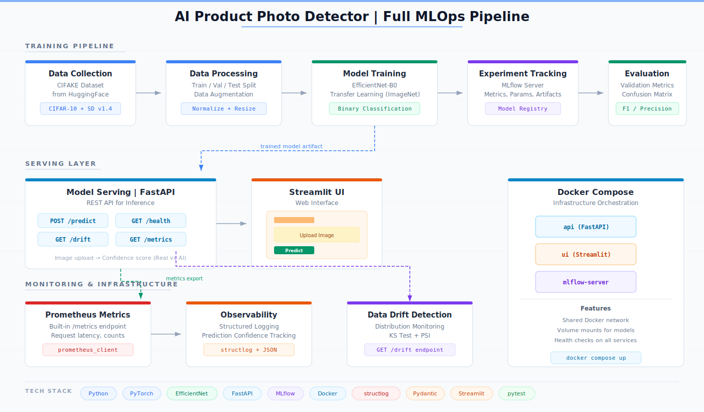

# AI Product Photo Detector

[](https://www.python.org/downloads/release/python-3110/)
[](https://pytorch.org/)
[](https://fastapi.tiangolo.com/)
[](https://opensource.org/licenses/MIT)

A MLOps system that classifies product images as **real** or **AI-generated**, helping e-commerce platforms detect fraudulent listings.

**Version:** 1.0.0

## Problem

E-commerce platforms face a growing threat: **AI-generated fake product images**. Scammers use generative models to create convincing product photos for items that don't exist. This project provides an API to detect these fake images.

## Features

- Binary classification: real vs AI-generated product images
- REST API with single and batch prediction endpoints
- Drift detection endpoint for monitoring model degradation
- Web UI (Streamlit) for interactive testing
- MLflow experiment tracking and model versioning
- Prometheus-compatible metrics endpoint
- Docker Compose deployment (API + MLflow + Streamlit)

## Architecture

<p align="center">
  
</p>

See [docs/ARCHITECTURE.md](docs/ARCHITECTURE.md) for detailed component documentation.

## Tech Stack

| Category | Technology |
|----------|------------|
| ML Framework | PyTorch + timm (EfficientNet-B0) |
| API | FastAPI + Uvicorn |
| Web UI | Streamlit |
| Experiment Tracking | MLflow |
| Containerization | Docker + Docker Compose |
| Monitoring | prometheus_client + structlog |

## Quick Start

### Installation

```bash
# Clone
git clone https://github.com/nolancacheux/AI-Product-Photo-Detector.git
cd AI-Product-Photo-Detector

# With uv (recommended)
uv venv
source .venv/bin/activate
uv pip install -e ".[dev,ui]"

# Or with pip
python -m venv .venv
source .venv/bin/activate
pip install -e ".[dev,ui]"
```

### Training

```bash
# Download real dataset (CIFAKE - CIFAR-10 real vs Stable Diffusion AI)
python scripts/download_cifake.py --max-per-class 2500

# Or use synthetic data for quick testing
python scripts/create_sample_data.py --output data/processed

# Train model
python -m src.training.train --config configs/train_config.yaml
```

### Run API

```bash
# Start server
uvicorn src.inference.api:app --host 0.0.0.0 --port 8000

# Test single prediction
curl -X POST "http://localhost:8000/predict" -F "file=@image.jpg"

# Check drift status
curl http://localhost:8000/drift
```

### Run UI

```bash
streamlit run src/ui/app.py
```

### Docker

```bash
docker-compose up -d
# API:        http://localhost:8000
# UI:         http://localhost:8501
# MLflow:     http://localhost:5000
```

## MLflow

Training runs are tracked with MLflow. Experiment data is stored in the `mlruns/` directory.

```bash
# View training experiments locally
mlflow ui --backend-store-uri mlruns --port 5000
# Then open http://localhost:5000
```

The `docker-compose.yml` includes an MLflow tracking server (port 5000) backed by SQLite for persistent experiment storage.

## API Reference

### POST /predict

Classify a single image.

```bash
curl -X POST "http://localhost:8000/predict" -F "file=@image.jpg"
```

Response:
```json
{
  "prediction": "ai_generated",
  "probability": 0.87,
  "confidence": "high",
  "inference_time_ms": 45.2,
  "model_version": "1.0.0"
}
```

### POST /predict/batch

Classify multiple images (max 20).

```bash
curl -X POST "http://localhost:8000/predict/batch" \
  -F "files=@img1.jpg" -F "files=@img2.jpg"
```

### GET /health

Returns service health status.

### GET /metrics

Prometheus-formatted metrics.

### GET /drift

Returns drift detection status (mean probability, low confidence ratio, drift score).

## Project Structure

```
mlops_project/
├── src/
│   ├── data/             # Data processing
│   ├── inference/        # FastAPI server & prediction
│   │   ├── api.py        # Endpoints
│   │   ├── predictor.py  # Model loading & inference
│   │   ├── schemas.py    # Pydantic models
│   │   ├── auth.py       # Optional API key auth
│   │   └── validation.py # Input validation
│   ├── monitoring/       # Metrics & drift detection
│   │   ├── metrics.py    # Prometheus-compatible metrics
│   │   └── drift.py      # Drift detector
│   ├── training/         # Training pipeline
│   │   ├── train.py      # Training loop (MLflow tracked)
│   │   ├── model.py      # EfficientNet-B0 architecture
│   │   ├── dataset.py    # PyTorch dataset
│   │   └── augmentation.py
│   ├── ui/               # Streamlit app
│   └── utils/            # Config & logging
├── tests/                # Unit tests
├── configs/              # Train/inference configs
├── docker/               # Dockerfiles
├── docs/                 # Documentation
├── models/               # Saved model checkpoints
├── scripts/              # Utility scripts
├── docker-compose.yml
├── pyproject.toml
└── Makefile
```

## Documentation

- [Architecture](docs/ARCHITECTURE.md) -- System design and component details
- [Contributing](docs/CONTRIBUTING.md) -- Development setup and workflow
- [Incident Scenario](docs/INCIDENT_SCENARIO.md) -- Data drift incident response scenario

## Testing

```bash
# Run all tests
pytest tests/ -v --cov=src

# Run specific test file
pytest tests/test_api.py -v
```

## Model Performance

| Metric | Value |
|--------|-------|
| Inference | ~50ms |

## Author

**Nolan Cacheux**
- GitHub: [nolancacheux](https://github.com/nolancacheux)
- LinkedIn: [nolancacheux](https://linkedin.com/in/nolancacheux)

## License

MIT License -- see [LICENSE](LICENSE)

---
*M2 MLOps -- JUNIA 2026*
