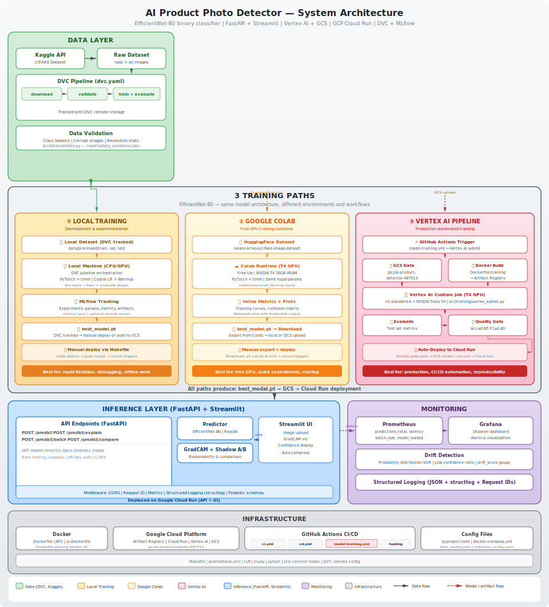

# AI Product Photo Detector

[](https://python.org)
[](https://pytorch.org)
[](https://fastapi.tiangolo.com)
[](https://cloud.google.com/run)
[](https://docker.com)
[](https://dvc.org)
[](LICENSE)
[](https://github.com/nolancacheux/AI-Product-Photo-Detector/actions)

**Production-grade MLOps pipeline for detecting AI-generated product photos in e-commerce listings.**

A complete end-to-end machine learning system — from data ingestion and model training to API serving, monitoring, and cloud deployment — built with modern MLOps best practices.

> **Live API** → [ai-product-detector-714127049161.europe-west1.run.app](https://ai-product-detector-714127049161.europe-west1.run.app)
> &nbsp;|&nbsp; **Swagger UI** → [/docs](https://ai-product-detector-714127049161.europe-west1.run.app/docs)
> &nbsp;|&nbsp; **Web UI** → [ai-product-detector-ui-714127049161.europe-west1.run.app](https://ai-product-detector-ui-714127049161.europe-west1.run.app)

---

## Features

- **Binary image classification** -- Detects whether a product photo is real or AI-generated
- **EfficientNet-B0 backbone** -- Transfer learning with pretrained ImageNet weights via `timm`
- **Grad-CAM explainability** -- Visual heatmaps showing which image regions drive the prediction
- **FastAPI serving** -- Async API with single, batch, and explainability endpoints
- **Docker-first** -- Multi-service stack with Compose (API + UI + MLflow + Prometheus + Grafana)
- **Full observability** -- Prometheus metrics, Grafana dashboards, structured JSON logging
- **DVC pipelines** -- Reproducible data download, validation, and training workflow
- **CI/CD to GCP Cloud Run** -- Automated deploy on push to `main` via GitHub Actions
- **Production hardening** -- Rate limiting, API key auth, CORS, input validation, drift detection
- **Comprehensive testing** -- Unit, integration, and load tests (Locust + k6)
- **Data validation** -- Automated dataset integrity checks with detailed reporting
- **Streamlit UI** -- Interactive web interface for drag-and-drop image analysis, deployed on Cloud Run

---

## Architecture

<p align="center">
  
</p>

The system follows a modular architecture with clear separation between training, serving, and monitoring concerns. See [`docs/ARCHITECTURE.md`](docs/ARCHITECTURE.md) for the full breakdown.

---

## Tech Stack

| Layer | Technologies |
|---|---|
| **Deep Learning** | PyTorch, torchvision, timm (EfficientNet-B0), Grad-CAM |
| **API** | FastAPI, Uvicorn, Pydantic v2, slowapi (rate limiting) |
| **MLOps** | DVC (pipelines + data versioning), MLflow (experiment tracking) |
| **Monitoring** | Prometheus, Grafana, structlog (JSON), custom drift detection |
| **Infrastructure** | Docker, Docker Compose, GCP Cloud Run, Artifact Registry |
| **CI/CD** | GitHub Actions (lint → type-check → test → security → deploy) |
| **Quality** | Ruff (lint + format), mypy (strict), pytest + coverage, Locust + k6 (load testing) |
| **UI** | Streamlit |

---

## Quick Start

### Prerequisites

- Python 3.11+
- [uv](https://docs.astral.sh/uv/) (recommended) or pip
- Docker & Docker Compose (for full stack)

### Installation

```bash
# Clone the repository
git clone https://github.com/nolancacheux/AI-Product-Photo-Detector.git
cd AI-Product-Photo-Detector

# Install dependencies
make install        # production only
make dev            # development (includes linting, testing, pre-commit)
```

### Train a Model

```bash
# Download the CIFAKE dataset (2500 images per class)
make data

# Train with default config
make train

# Or reproduce the full DVC pipeline (download → validate → train)
make dvc-repro
```

Training configuration is in [`configs/train_config.yaml`](configs/train_config.yaml). Key hyperparameters:

| Parameter | Value |
|---|---|
| Architecture | EfficientNet-B0 (pretrained) |
| Image size | 224×224 |
| Batch size | 64 |
| Epochs | 15 |
| Learning rate | 0.001 |
| Scheduler | Cosine annealing with warmup |
| Early stopping | Patience: 5 epochs |

### Serve the API

```bash
# Local development (with hot reload)
make serve

# Production (Docker)
make docker-build
make docker-run

# Full stack (API + UI + MLflow + Prometheus + Grafana)
make docker-up
```

### Run Tests

```bash
make test           # Unit + integration tests with coverage
make lint           # Ruff + mypy
make load-test      # Locust load test (10 users, 60s)
make load-test-k6   # k6 load test
```

---

## API Documentation

Base URL: `https://ai-product-detector-714127049161.europe-west1.run.app`

Interactive documentation: [`/docs`](https://ai-product-detector-714127049161.europe-west1.run.app/docs) (Swagger UI)

### Endpoints

#### `POST /predict` — Single Image Prediction

Classifies an image as `real` or `ai_generated` with a confidence score.

```bash
curl -X POST https://ai-product-detector-714127049161.europe-west1.run.app/predict \
  -H "X-API-Key: YOUR_API_KEY" \
  -F "file=@product_photo.jpg"
```

**Response:**
```json
{
  "prediction": "ai_generated",
  "probability": 0.87,
  "confidence": "high",
  "inference_time_ms": 45.2,
  "model_version": "1.0.0"
}
```

| Field | Type | Description |
|---|---|---|
| `prediction` | string | `real` or `ai_generated` |
| `probability` | float | Probability of being AI-generated (0.0–1.0) |
| `confidence` | string | `low` (<0.3), `medium` (0.3–0.8), `high` (>0.8) |
| `inference_time_ms` | float | Inference latency in milliseconds |
| `model_version` | string | Model version used |

**Constraints:** JPEG, PNG, or WebP — max 5 MB — rate limited to 30 req/min.

---

#### `POST /predict/batch` — Batch Prediction

Classify up to 10 images in a single request.

```bash
curl -X POST https://ai-product-detector-714127049161.europe-west1.run.app/predict/batch \
  -H "X-API-Key: YOUR_API_KEY" \
  -F "files=@photo1.jpg" \
  -F "files=@photo2.png"
```

**Response:**
```json
{
  "results": [
    {
      "filename": "photo1.jpg",
      "prediction": "ai_generated",
      "probability": 0.87,
      "confidence": "high",
      "error": null
    },
    {
      "filename": "photo2.png",
      "prediction": "real",
      "probability": 0.12,
      "confidence": "high",
      "error": null
    }
  ],
  "total": 2,
  "successful": 2,
  "failed": 0,
  "total_inference_time_ms": 89.5,
  "model_version": "1.0.0"
}
```

**Constraints:** Max 10 images — 5 MB each — 50 MB total payload — rate limited to 5 req/min.

---

#### `POST /predict/explain` — Prediction with Grad-CAM Heatmap

Returns the prediction plus a base64-encoded JPEG heatmap showing which regions influenced the decision.

```bash
curl -X POST https://ai-product-detector-714127049161.europe-west1.run.app/predict/explain \
  -H "X-API-Key: YOUR_API_KEY" \
  -F "file=@product_photo.jpg"
```

**Response:**
```json
{
  "prediction": "ai_generated",
  "probability": 0.87,
  "confidence": "high",
  "heatmap_base64": "/9j/4AAQ...",
  "inference_time_ms": 120.5,
  "model_version": "1.0.0"
}
```

**Constraints:** Rate limited to 10 req/min (heavier computation).

---

#### `GET /health` — Readiness Probe

```bash
curl https://ai-product-detector-714127049161.europe-west1.run.app/health
```

```json
{
  "status": "healthy",
  "model_loaded": true,
  "model_version": "1.0.0",
  "uptime_seconds": 3600.5,
  "active_requests": 2,
  "drift_detected": false,
  "predictions_total": 1542
}
```

---

#### `GET /healthz` — Liveness Probe

Lightweight probe for Kubernetes / Cloud Run. Returns `200` if the process is alive.

```bash
curl https://ai-product-detector-714127049161.europe-west1.run.app/healthz
```

---

#### `GET /metrics` — Prometheus Metrics

Exposes all application metrics in Prometheus text format.

```bash
curl https://ai-product-detector-714127049161.europe-west1.run.app/metrics
```

---

#### `GET /drift` — Drift Detection Status

Returns current drift monitoring metrics including alerts.

```bash
curl https://ai-product-detector-714127049161.europe-west1.run.app/drift
```

---

#### `GET /privacy` — Privacy Policy

Returns data handling and privacy information (GDPR-friendly — no data is stored).

---

### Authentication

Authentication is controlled via environment variables:

| Variable | Description |
|---|---|
| `API_KEYS` | Comma-separated list of valid API keys |
| `REQUIRE_AUTH` | Set to `true` to enforce authentication (rejects all requests if no keys configured) |

When auth is disabled (default for local dev), all endpoints are publicly accessible.

### Error Handling

All errors follow a consistent format:

```json
{
  "error": "Invalid image format",
  "detail": "Supported formats: JPEG, PNG, WebP. Got: image/gif"
}
```

| Status | Meaning |
|---|---|
| `400` | Invalid input (bad format, empty batch) |
| `401` | Missing or invalid API key |
| `413` | File too large (>5 MB or batch >50 MB) |
| `429` | Rate limit exceeded |
| `503` | Model not loaded / service unavailable |

---

## MLOps Pipeline

### DVC — Reproducible Pipelines

The entire workflow is orchestrated with [DVC](https://dvc.org):

```yaml
# dvc.yaml
stages:
  download:   # Download CIFAKE dataset
  validate:   # Validate data integrity → reports/data_validation.json
  train:      # Train model → models/checkpoints/best_model.pt
```

```bash
dvc repro           # Run the full pipeline
dvc repro train     # Re-run training only
dvc status          # Check what's changed
```

### CI/CD — GitHub Actions

Three workflows automate quality and deployment:

| Workflow | Trigger | Pipeline |
|---|---|---|
| **CI** ([`ci.yml`](.github/workflows/ci.yml)) | Push / PR to `main` | Lint, type check, test (3.11 + 3.12), security scan, Docker build |
| **CD** ([`cd.yml`](.github/workflows/cd.yml)) | Push to `main` / Manual dispatch | Wait for CI, build and push to Artifact Registry, deploy to Cloud Run, smoke test |
| **Model Training** ([`model-training.yml`](.github/workflows/model-training.yml)) | Manual dispatch | Pull data, train model, evaluate, upload model artifact |

The CD pipeline automatically deploys to GCP Cloud Run on every push to `main` after CI passes.

### Experiment Tracking — MLflow

All training runs are logged to MLflow with hyperparameters, metrics, and model artifacts:

```bash
make mlflow         # Start MLflow UI on port 5000
```

---

## Cloud Deployment

### GCP Cloud Run

The API is deployed as a serverless container on Google Cloud Run:

```
Region:             europe-west1
Memory:             1 Gi (configurable: 512Mi / 1Gi / 2Gi)
Port:               8080
Container Registry: europe-west1-docker.pkg.dev
Scaling:            0 → N (automatic)
Auth:               API key via X-API-Key header
```

**Deployment flow:**

```
git push main → CI passes → Docker build → Push to Artifact Registry → Deploy to Cloud Run → Health check
```

**Manual deploy / rollback:**

```bash
# Deploy latest
make deploy

# Rollback to specific commit
gh workflow run cd.yml -f image_tag=<commit-sha>
```

### Docker

```bash
# Build the API image (CPU-optimized PyTorch)
docker build -f docker/Dockerfile -t ai-product-detector:1.0.0 .

# Run standalone
docker run --rm -p 8080:8080 -v ./models:/app/models:ro ai-product-detector:1.0.0

# Full stack with docker-compose
docker compose up -d    # API + Streamlit UI + MLflow + Prometheus + Grafana
docker compose logs -f  # Follow logs
docker compose down     # Tear down
```

**Service ports (docker-compose):**

| Service | Port | URL |
|---|---|---|
| API | 8080 | http://localhost:8080 |
| Streamlit UI | 8501 | http://localhost:8501 |
| MLflow | 5000 | http://localhost:5000 |
| Prometheus | 9090 | http://localhost:9090 |
| Grafana | 3000 | http://localhost:3000 |

---

## Streamlit UI

An interactive web interface built with Streamlit provides drag-and-drop image analysis with real-time predictions and Grad-CAM visualizations.

**Live deployment:** [ai-product-detector-ui-714127049161.europe-west1.run.app](https://ai-product-detector-ui-714127049161.europe-west1.run.app)

```bash
# Run locally
make ui

# Run via Docker
docker build -f docker/ui.Dockerfile -t ai-product-detector-ui .
docker run --rm -p 8501:8501 ai-product-detector-ui
```

The UI is also included in the Docker Compose stack and is automatically deployed to Cloud Run alongside the API.

---

## Monitoring

### Prometheus Metrics

The API exposes a comprehensive set of custom metrics at `/metrics`:

| Metric | Type | Description |
|---|---|---|
| `aidetect_predictions_total` | Counter | Total predictions by status/class/confidence |
| `aidetect_prediction_latency_seconds` | Histogram | Per-prediction latency distribution |
| `aidetect_prediction_probability` | Histogram | Distribution of prediction probabilities |
| `aidetect_batch_predictions_total` | Counter | Batch request count |
| `aidetect_batch_size` | Histogram | Number of images per batch request |
| `aidetect_batch_latency_seconds` | Histogram | Batch processing time |
| `aidetect_image_validation_errors_total` | Counter | Validation errors by type |
| `aidetect_model_loaded` | Gauge | Model load status (0/1) |
| `aidetect_request_size_bytes` | Histogram | Request payload size |
| `aidetect_response_size_bytes` | Histogram | Response payload size |
| `http_request_duration_seconds` | Histogram | HTTP request latency by endpoint |
| `http_requests_total` | Counter | HTTP requests by method/endpoint/status |

### Drift Detection

A custom drift detector monitors prediction distribution in real-time:

- Sliding window over the last 1000 predictions
- Tracks mean probability, confidence distribution, and class ratios
- Alerts when metrics deviate from baseline (configurable threshold)
- Status available at `GET /drift`

### Grafana Dashboards

Pre-configured Grafana dashboards with Prometheus as data source. Auto-provisioned via `configs/grafana/provisioning/`.

Default credentials: `admin` / `admin`

### Structured Logging

All application logs use `structlog` with JSON output, including:

- Request ID tracking (via `X-Request-ID` header)
- Cloud Trace context correlation (GCP)
- Prediction metadata (result, probability, latency)

---

## Project Structure

```
AI-Product-Photo-Detector/
├── .github/
│   └── workflows/
│       ├── ci.yml                  # CI: lint + type check + test + security
│       ├── cd.yml                  # CD: build + push + deploy to Cloud Run
│       └── model-training.yml      # Model training pipeline (manual)
├── configs/
│   ├── grafana/
│   │   ├── dashboards/             # Grafana dashboard JSON definitions
│   │   └── provisioning/           # Datasource and dashboard provisioning
│   ├── inference_config.yaml       # API server configuration
│   ├── prometheus.yml              # Prometheus scrape targets
│   └── train_config.yaml           # Training hyperparameters
├── docker/
│   ├── Dockerfile                  # API production image (CPU PyTorch, non-root)
│   ├── serve.Dockerfile            # Serving-optimized image
│   ├── train.Dockerfile            # Training image
│   └── ui.Dockerfile               # Streamlit UI image
├── docs/
│   ├── architecture.svg            # System architecture diagram
│   ├── ARCHITECTURE.md             # Detailed architecture documentation
│   ├── AUDIT_ARCHITECTURE.md       # Architecture audit report
│   ├── CONTRIBUTING.md             # Contribution guidelines
│   ├── COSTS.md                    # Cloud cost analysis
│   ├── INCIDENT_SCENARIO.md        # Incident response playbook
│   └── PRD.md                      # Product requirements document
├── scripts/
│   ├── create_sample_data.py       # Generate sample test images
│   ├── download_cifake.py          # Download CIFAKE dataset
│   └── download_dataset.py         # Generic dataset downloader
├── src/
│   ├── data/
│   │   └── validate.py             # Dataset validation and integrity checks
│   ├── inference/
│   │   ├── api.py                  # FastAPI application and routes
│   │   ├── auth.py                 # API key authentication (HMAC + constant-time)
│   │   ├── explainer.py            # Grad-CAM heatmap generation
│   │   ├── predictor.py            # Model inference engine
│   │   ├── routes/                 # Modular route definitions
│   │   ├── schemas.py              # Pydantic request/response schemas
│   │   ├── shadow.py               # Shadow model comparison
│   │   ├── state.py                # Application state management
│   │   └── validation.py           # Image validation utilities
│   ├── monitoring/
│   │   ├── drift.py                # Real-time drift detection
│   │   └── metrics.py              # Prometheus metric definitions
│   ├── training/
│   │   ├── augmentation.py         # Data augmentation transforms
│   │   ├── dataset.py              # PyTorch Dataset implementation
│   │   ├── model.py                # EfficientNet-B0 architecture
│   │   └── train.py                # Training loop with MLflow tracking
│   ├── ui/
│   │   └── app.py                  # Streamlit web interface
│   └── utils/
│       ├── config.py               # Settings management (Pydantic Settings)
│       └── logger.py               # Structured logging setup
├── tests/
│   ├── load/
│   │   ├── locustfile.py           # Locust load testing scenarios
│   │   └── k6_test.js             # k6 load testing script
│   ├── test_api.py                 # API endpoint tests
│   ├── test_augmentation.py        # Data augmentation tests
│   ├── test_auth.py                # Authentication tests
│   ├── test_batch.py               # Batch prediction tests
│   ├── test_config.py              # Configuration tests
│   ├── test_dataset.py             # Dataset tests
│   ├── test_drift.py               # Drift detection tests
│   ├── test_drift_extended.py      # Extended drift detection tests
│   ├── test_explainer.py           # Grad-CAM tests
│   ├── test_integration.py         # Integration tests
│   ├── test_logger.py              # Logging tests
│   ├── test_metrics.py             # Prometheus metrics tests
│   ├── test_model.py               # Model architecture tests
│   ├── test_predictor.py           # Inference engine tests
│   ├── test_predictor_extended.py  # Extended predictor tests
│   └── test_validation.py          # Image validation tests
├── docker-compose.yml              # Full stack orchestration
├── dvc.yaml                        # DVC pipeline definition
├── Makefile                        # Development commands
├── pyproject.toml                  # Project metadata and dependencies
└── .pre-commit-config.yaml         # Pre-commit hooks (ruff)
```

---

## Contributing

Contributions are welcome. Please read [`docs/CONTRIBUTING.md`](docs/CONTRIBUTING.md) for guidelines.

```bash
# Setup development environment
make dev

# Run quality checks before submitting
make lint
make test
```

This project uses:
- **Ruff** for linting and formatting
- **mypy** (strict mode) for type checking
- **pre-commit** hooks for automated checks
- **Conventional commits** (`feat:`, `fix:`, `docs:`, etc.)

---

## License

This project is licensed under the MIT License — see [LICENSE](LICENSE) for details.

---

**Built by [Nolan Cacheux](https://github.com/nolancacheux)**
