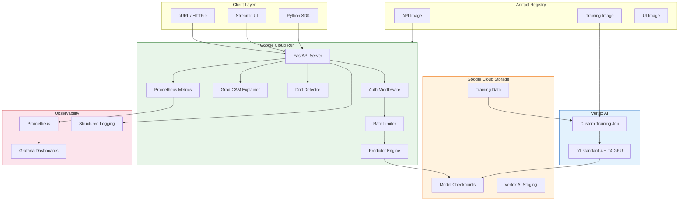
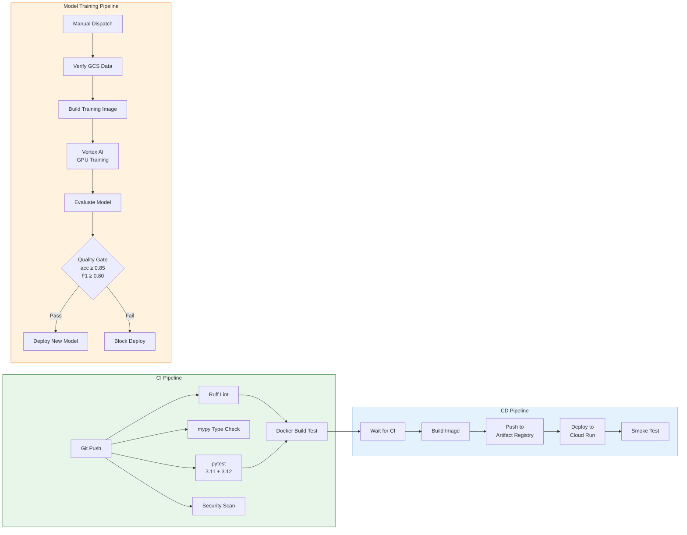
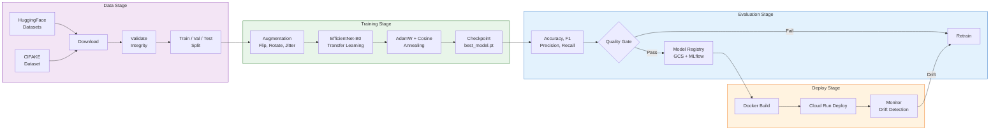

<p align="center">
  <h1 align="center">🔍 AI Product Photo Detector</h1>
  <p align="center">
    <strong>Production-grade MLOps system for detecting AI-generated product photos in e-commerce</strong>
  </p>
</p>

<p align="center">
  <a href="https://github.com/nolancacheux/AI-Product-Photo-Detector/actions/workflows/ci.yml"></a>
  <a href="https://github.com/nolancacheux/AI-Product-Photo-Detector/actions/workflows/cd.yml"></a>
  <a href="https://github.com/nolancacheux/AI-Product-Photo-Detector/actions/workflows/model-training.yml"></a>
  <br/>
  <a href="https://www.python.org/"></a>
  <a href="https://pytorch.org/"></a>
  <a href="https://fastapi.tiangolo.com/"></a>
  <a href="https://cloud.google.com/run"></a>
  <a href="https://docker.com/"></a>
  <a href="https://dvc.org/"></a>
  <a href="https://github.com/nolancacheux/AI-Product-Photo-Detector/blob/main/LICENSE"></a>
  <a href="https://colab.research.google.com/github/nolancacheux/AI-Product-Photo-Detector/blob/main/notebooks/train_colab.ipynb"></a>
</p>

<p align="center">
  End-to-end machine learning system — from data ingestion and GPU training on Vertex AI<br/>
  to API serving, real-time monitoring, and automated cloud deployment.
</p>

---

## 🌐 Live Demo

| Resource | URL |
|----------|-----|
| **🚀 REST API** | [`ai-product-detector-714127049161.europe-west1.run.app`](https://ai-product-detector-714127049161.europe-west1.run.app) |
| **🖥️ Web UI** | [`ai-product-detector-ui-714127049161.europe-west1.run.app`](https://ai-product-detector-ui-714127049161.europe-west1.run.app) |
| **📖 Swagger Docs** | [`/docs`](https://ai-product-detector-714127049161.europe-west1.run.app/docs) |
| **📊 Health Check** | [`/health`](https://ai-product-detector-714127049161.europe-west1.run.app/health) |
| **📈 Metrics** | [`/metrics`](https://ai-product-detector-714127049161.europe-west1.run.app/metrics) |

```bash
# Try it now — single prediction
curl -X POST https://ai-product-detector-714127049161.europe-west1.run.app/predict \
  -H "X-API-Key: YOUR_API_KEY" \
  -F "file=@product_photo.jpg"
```

---

## 🏗️ Architecture

### System Overview



### CI/CD Pipeline



### ML Pipeline



---

## ✨ Features

### 🧠 Core ML
- **Binary image classification** — Real vs AI-generated product photos
- **EfficientNet-B0 backbone** — Transfer learning with pretrained ImageNet weights via `timm`
- **Grad-CAM explainability** — Visual heatmaps showing which regions drive the prediction
- **Data augmentation** — Horizontal flip, rotation, color jitter, random crop
- **Cosine annealing** — Learning rate scheduling with warmup

### 🚀 API & Serving
- **FastAPI async server** — Single, batch (up to 10), and explainability endpoints
- **API key authentication** — HMAC-based constant-time comparison
- **Rate limiting** — Per-endpoint configurable limits via `slowapi`
- **Input validation** — File type, size, and format verification
- **Structured responses** — Pydantic v2 schemas with confidence levels

### 🔄 MLOps
- **DVC pipelines** — Reproducible `download → validate → train` workflow
- **MLflow experiment tracking** — Hyperparameters, metrics, and model artifacts
- **Vertex AI training** — Automated GPU training with T4 on GCP
- **Quality gate** — Automated accuracy/F1 thresholds before deployment
- **Model versioning** — GCS-backed model registry with DVC tracking

### 📊 Monitoring & Observability
- **Prometheus metrics** — 12+ custom metrics (latency, throughput, probability distribution)
- **Grafana dashboards** — Pre-configured, auto-provisioned dashboards
- **Drift detection** — Real-time prediction distribution monitoring (sliding window)
- **Structured logging** — JSON output via `structlog` with request ID correlation

### 🔐 Security
- **API key auth** — Optional, enforced in production via environment variables
- **Rate limiting** — Abuse prevention on all prediction endpoints
- **Non-root containers** — Docker images run as unprivileged users
- **Security scanning** — `pip-audit` + `bandit` in CI pipeline
- **CORS configuration** — Configurable allowed origins

### 🏗️ Infrastructure
- **Terraform IaC** — GCS, Artifact Registry, Cloud Run, IAM, budget alerts
- **Docker Compose** — Full local stack (API + UI + MLflow + Prometheus + Grafana)
- **GitHub Actions CI/CD** — Automated lint, test, build, deploy on every push
- **Serverless scaling** — Cloud Run auto-scales 0→N based on traffic

---

## 🚀 Quick Start

### Local Development

**Prerequisites:** Python 3.11+, [uv](https://docs.astral.sh/uv/) (recommended) or pip, Docker & Docker Compose

```bash
# Clone the repository
git clone https://github.com/nolancacheux/AI-Product-Photo-Detector.git
cd AI-Product-Photo-Detector

# Install all dependencies (dev + ui + pre-commit hooks)
make dev

# Download dataset and train a model
make data           # Download CIFAKE (2500 images/class)
make train          # Train EfficientNet-B0

# Start the API server with hot reload
make serve          # → http://localhost:8000

# Or start the full stack with Docker Compose
make docker-up      # API + UI + MLflow + Prometheus + Grafana
```

**Service URLs (Docker Compose):**

| Service | URL | Description |
|---------|-----|-------------|
| **API** | http://localhost:8080 | FastAPI inference server |
| **Streamlit UI** | http://localhost:8501 | Drag-and-drop image analysis |
| **MLflow** | http://localhost:5000 | Experiment tracking UI |
| **Prometheus** | http://localhost:9090 | Metrics collection |
| **Grafana** | http://localhost:3000 | Monitoring dashboards |

### Production Deployment

```bash
# 1. Provision infrastructure with Terraform
cd terraform
cp terraform.tfvars.example terraform.tfvars  # Edit with your GCP project
terraform init && terraform apply

# 2. Push to main — CI/CD handles the rest
git push origin main
# CI: lint → type-check → test (3.11 + 3.12) → security scan
# CD: build image → push to Artifact Registry → deploy to Cloud Run → smoke test

# 3. Trigger GPU training on Vertex AI
gh workflow run model-training.yml \
  -f epochs=15 \
  -f batch_size=64 \
  -f auto_deploy=true
```

---

## 📡 API Documentation

**Base URL:** `https://ai-product-detector-714127049161.europe-west1.run.app`
&nbsp;|&nbsp; **Interactive docs:** [`/docs`](https://ai-product-detector-714127049161.europe-west1.run.app/docs)

### Endpoints

| Method | Endpoint | Description | Rate Limit |
|--------|----------|-------------|------------|
| `POST` | `/predict` | Single image classification | 30/min |
| `POST` | `/predict/batch` | Batch classification (up to 10) | 5/min |
| `POST` | `/predict/explain` | Prediction + Grad-CAM heatmap | 10/min |
| `GET` | `/health` | Readiness probe (model status, uptime, drift) | — |
| `GET` | `/healthz` | Lightweight liveness probe | — |
| `GET` | `/metrics` | Prometheus metrics (text format) | — |
| `GET` | `/drift` | Drift detection status | — |
| `GET` | `/privacy` | GDPR privacy policy | — |

### Single Prediction

```bash
curl -X POST https://ai-product-detector-714127049161.europe-west1.run.app/predict \
  -H "X-API-Key: YOUR_API_KEY" \
  -F "file=@product_photo.jpg"
```

```json
{
  "prediction": "ai_generated",
  "probability": 0.87,
  "confidence": "high",
  "inference_time_ms": 45.2,
  "model_version": "1.0.0"
}
```

### Batch Prediction

```bash
curl -X POST https://ai-product-detector-714127049161.europe-west1.run.app/predict/batch \
  -H "X-API-Key: YOUR_API_KEY" \
  -F "files=@photo1.jpg" \
  -F "files=@photo2.png"
```

```json
{
  "results": [
    { "filename": "photo1.jpg", "prediction": "ai_generated", "probability": 0.87, "confidence": "high" },
    { "filename": "photo2.png", "prediction": "real", "probability": 0.12, "confidence": "high" }
  ],
  "total": 2,
  "successful": 2,
  "failed": 0,
  "total_inference_time_ms": 89.5
}
```

### Explainability (Grad-CAM)

```bash
curl -X POST https://ai-product-detector-714127049161.europe-west1.run.app/predict/explain \
  -H "X-API-Key: YOUR_API_KEY" \
  -F "file=@product_photo.jpg"
```

```json
{
  "prediction": "ai_generated",
  "probability": 0.87,
  "confidence": "high",
  "heatmap_base64": "/9j/4AAQ...",
  "inference_time_ms": 120.5
}
```

### Authentication

| Variable | Description |
|----------|-------------|
| `API_KEYS` | Comma-separated list of valid API keys |
| `REQUIRE_AUTH` | Set to `true` to enforce auth (default: disabled for local dev) |

Pass the key via header: `X-API-Key: YOUR_KEY`

### Error Responses

```json
{ "error": "Invalid image format", "detail": "Supported formats: JPEG, PNG, WebP. Got: image/gif" }
```

| Status | Meaning |
|--------|---------|
| `400` | Invalid input (bad format, empty batch) |
| `401` | Missing or invalid API key |
| `413` | File too large (>5 MB) or batch payload >50 MB |
| `429` | Rate limit exceeded |
| `503` | Model not loaded / service starting |

---

## 🔬 MLOps Pipeline

### Training Options

| | **Google Colab** | **Vertex AI** | **Local** |
|---|---|---|---|
| **GPU** | Free T4 | T4 on GCP (paid) | CPU or local GPU |
| **Cost** | Free | ~$0.10–0.20/run | Free |
| **Time** | ~20 min | ~25 min | ~1–2h (CPU) |
| **Dataset** | HuggingFace (high-res) | GCS (auto-uploaded) | CIFAKE (DVC) |
| **Best for** | Quick experiments | Production retraining | Development |

#### Colab (Quick Start)

[](https://colab.research.google.com/github/nolancacheux/AI-Product-Photo-Detector/blob/main/notebooks/train_colab.ipynb)

Open → set runtime to T4 GPU → run all cells → download checkpoint.

#### Vertex AI (Production)

```bash
# Trigger via GitHub Actions
gh workflow run model-training.yml -f epochs=15 -f batch_size=64 -f auto_deploy=true

# Or submit directly
python -m src.training.vertex_submit --epochs 15 --batch-size 64 --sync
```

**Pipeline stages:**

```
[1] Verify Data → [2] Build Image → [3] GPU Training → [4] Evaluate → [5] Quality Gate → [6] Deploy
     (GCS)        (Artifact Reg.)    (Vertex AI T4)      (CPU)        (acc≥0.85,F1≥0.80)  (Cloud Run)
```

#### Local Training

```bash
make data            # Download CIFAKE dataset
make train           # Train with configs/train_config.yaml
make dvc-repro       # Full DVC pipeline: download → validate → train
make mlflow          # Start MLflow UI → http://localhost:5000
```

### DVC Pipeline

```yaml
# dvc.yaml — 3-stage reproducible pipeline
stages:
  download:   # Download CIFAKE dataset → data/processed/
  validate:   # Integrity checks → reports/data_validation.json
  train:      # EfficientNet-B0 → models/checkpoints/best_model.pt
```

```bash
dvc repro            # Run full pipeline
dvc repro train      # Re-run training only
dvc status           # Check what changed
```

### Training Configuration

| Parameter | Value |
|-----------|-------|
| Architecture | EfficientNet-B0 (ImageNet pretrained) |
| Image size | 224 × 224 |
| Batch size | 64 |
| Epochs | 15 |
| Optimizer | AdamW, lr=0.001 |
| Scheduler | Cosine annealing with 2-epoch warmup |
| Early stopping | Patience: 5 epochs |
| Augmentation | Flip, rotation, color jitter, random crop |

---

## 📊 Monitoring & Observability

### Prometheus Metrics

All exposed at `GET /metrics` in Prometheus text format:

| Metric | Type | Description |
|--------|------|-------------|
| `aidetect_predictions_total` | Counter | Total predictions by status / class / confidence |
| `aidetect_prediction_latency_seconds` | Histogram | Per-prediction latency distribution |
| `aidetect_prediction_probability` | Histogram | Probability score distribution |
| `aidetect_batch_predictions_total` | Counter | Batch request count |
| `aidetect_batch_size` | Histogram | Images per batch request |
| `aidetect_batch_latency_seconds` | Histogram | Batch processing time |
| `aidetect_image_validation_errors_total` | Counter | Validation errors by type |
| `aidetect_model_loaded` | Gauge | Model load status (0/1) |
| `aidetect_request_size_bytes` | Histogram | Request payload size |
| `aidetect_response_size_bytes` | Histogram | Response payload size |
| `http_request_duration_seconds` | Histogram | HTTP latency by endpoint |
| `http_requests_total` | Counter | HTTP requests by method / endpoint / status |

### Drift Detection

Real-time monitoring of prediction distribution shifts:

- **Sliding window** over the last 1,000 predictions
- **Tracked signals:** Mean probability, confidence distribution, class ratios
- **Alerting:** Configurable threshold with status at `GET /drift`
- **Feedback loop:** Drift triggers model retraining consideration

### Grafana Dashboards

Pre-configured and auto-provisioned via `configs/grafana/provisioning/`:

- **Request throughput** — Requests/sec by endpoint
- **Latency percentiles** — p50, p90, p99 per endpoint
- **Prediction distribution** — Real vs AI-generated ratio over time
- **Model health** — Load status, drift alerts, error rates

Default credentials: `admin` / `admin`

### Structured Logging

```json
{
  "event": "prediction_complete",
  "prediction": "ai_generated",
  "probability": 0.87,
  "latency_ms": 45.2,
  "request_id": "abc-123",
  "timestamp": "2024-01-15T10:30:00Z"
}
```

- `structlog` with JSON output
- Request ID tracking via `X-Request-ID` header
- Cloud Trace context correlation (GCP)

---

## 🛠️ Tech Stack

| Category | Technologies |
|----------|-------------|
| **Deep Learning** | PyTorch 2.0+, torchvision, timm (EfficientNet-B0), Grad-CAM |
| **API Framework** | FastAPI, Uvicorn, Pydantic v2, slowapi |
| **Data & MLOps** | DVC (pipelines + versioning), MLflow (experiment tracking), HuggingFace Datasets |
| **Cloud Training** | Vertex AI (CustomContainerTrainingJob), T4 GPU, Google Cloud Storage |
| **Monitoring** | Prometheus, Grafana, structlog (JSON), custom drift detection |
| **Infrastructure** | Docker, Docker Compose, Terraform, GCP Cloud Run, Artifact Registry |
| **CI/CD** | GitHub Actions (3 workflows: CI, CD, Model Training) |
| **Code Quality** | Ruff (lint + format), mypy (strict), pytest + coverage, pre-commit |
| **Load Testing** | Locust, k6 |
| **Security** | pip-audit, bandit, HMAC auth, non-root containers |
| **UI** | Streamlit (deployed on Cloud Run) |

---

## 📁 Project Structure

```
AI-Product-Photo-Detector/
│
├── .github/workflows/
│   ├── ci.yml                          # CI: lint + type-check + test (3.11, 3.12) + security
│   ├── cd.yml                          # CD: build → push → deploy Cloud Run → smoke test
│   └── model-training.yml              # Vertex AI: data → train (GPU) → eval → gate → deploy
│
├── configs/
│   ├── grafana/                        # Grafana dashboard definitions + provisioning
│   ├── inference_config.yaml           # API server configuration
│   ├── pipeline_config.yaml            # Vertex AI pipeline parameters
│   ├── prometheus.yml                  # Prometheus scrape targets
│   └── train_config.yaml              # Training hyperparameters
│
├── docker/
│   ├── Dockerfile                      # Production API image (CPU PyTorch, non-root)
│   ├── Dockerfile.training             # Vertex AI GPU training image
│   ├── serve.Dockerfile                # Serving-optimized image
│   ├── train.Dockerfile                # Local training environment
│   └── ui.Dockerfile                   # Streamlit UI image
│
├── docs/
│   ├── ARCHITECTURE.md                 # System architecture & design decisions
│   ├── CICD.md                         # CI/CD pipeline documentation
│   ├── CONTRIBUTING.md                 # Contribution guidelines
│   ├── COSTS.md                        # Cloud cost analysis
│   ├── DEPLOYMENT.md                   # Deployment guide
│   ├── INCIDENT_SCENARIO.md            # Incident response playbook
│   ├── INFRASTRUCTURE.md               # Infrastructure documentation
│   ├── PRD.md                          # Product requirements document
│   └── TRAINING.md                     # Training pipeline documentation
│
├── notebooks/
│   └── train_colab.ipynb               # Colab notebook — free T4 GPU training
│
├── scripts/
│   ├── create_sample_data.py           # Generate sample test images
│   ├── download_cifake.py              # Download CIFAKE dataset
│   └── download_dataset.py             # Generic dataset downloader
│
├── src/
│   ├── data/
│   │   └── validate.py                 # Dataset validation & integrity checks
│   ├── inference/
│   │   ├── api.py                      # FastAPI application & routes
│   │   ├── auth.py                     # API key auth (HMAC, constant-time)
│   │   ├── explainer.py                # Grad-CAM heatmap generation
│   │   ├── predictor.py                # Model inference engine
│   │   ├── rate_limit.py               # Rate limiting configuration
│   │   ├── schemas.py                  # Pydantic request/response models
│   │   ├── shadow.py                   # Shadow model comparison (A/B testing)
│   │   ├── state.py                    # Application state management
│   │   └── validation.py               # Image validation utilities
│   ├── monitoring/
│   │   ├── drift.py                    # Real-time drift detection
│   │   └── metrics.py                  # Prometheus metric definitions
│   ├── pipelines/
│   │   ├── evaluate.py                 # Model evaluation pipeline stage
│   │   └── training_pipeline.py        # End-to-end training orchestrator
│   ├── training/
│   │   ├── augmentation.py             # Data augmentation transforms
│   │   ├── dataset.py                  # PyTorch Dataset implementation
│   │   ├── gcs.py                      # GCS upload/download helpers
│   │   ├── model.py                    # EfficientNet-B0 architecture
│   │   ├── train.py                    # Training loop with MLflow tracking
│   │   └── vertex_submit.py            # Vertex AI job submission CLI
│   ├── ui/
│   │   └── app.py                      # Streamlit web interface
│   └── utils/
│       ├── config.py                   # Settings management (Pydantic Settings)
│       ├── logger.py                   # Structured logging setup
│       └── model_loader.py             # Model loading utilities
│
├── terraform/
│   ├── main.tf                         # GCS + Artifact Registry + Cloud Run + IAM + Budget
│   ├── variables.tf                    # Input variables
│   ├── outputs.tf                      # Output values
│   └── terraform.tfvars.example        # Example configuration
│
├── tests/
│   ├── load/
│   │   ├── locustfile.py               # Locust load testing scenarios
│   │   └── k6_test.js                  # k6 load testing script
│   ├── conftest.py                     # Shared test fixtures
│   ├── test_api.py                     # API endpoint tests
│   ├── test_augmentation.py            # Augmentation tests
│   ├── test_auth.py                    # Authentication tests
│   ├── test_batch.py                   # Batch prediction tests
│   ├── test_config.py                  # Configuration tests
│   ├── test_data_validate.py           # Data validation tests
│   ├── test_dataset.py                 # Dataset tests
│   ├── test_drift.py                   # Drift detection tests
│   ├── test_explainer.py               # Grad-CAM tests
│   ├── test_gcs.py                     # GCS helper tests
│   ├── test_integration.py             # Integration tests
│   ├── test_metrics.py                 # Prometheus metrics tests
│   ├── test_model.py                   # Model architecture tests
│   ├── test_pipelines.py               # Pipeline orchestration tests
│   ├── test_predictor.py               # Inference engine tests
│   ├── test_shadow.py                  # Shadow A/B testing tests
│   ├── test_train.py                   # Training loop tests
│   ├── test_ui.py                      # UI tests
│   ├── test_validation.py              # Validation tests
│   └── test_vertex_submit.py           # Vertex AI submission tests
│
├── docker-compose.yml                  # Full stack: API + UI + MLflow + Prometheus + Grafana
├── dvc.yaml                            # DVC pipeline: download → validate → train
├── Makefile                            # Development commands (make help)
├── pyproject.toml                      # Project metadata, dependencies, tool config
└── .pre-commit-config.yaml             # Pre-commit hooks (ruff)
```

---

## 🐳 Docker

```bash
# Build API image
docker build -f docker/Dockerfile -t ai-product-detector:latest .

# Run standalone
docker run --rm -p 8080:8080 -v ./models:/app/models:ro ai-product-detector:latest

# Full stack (API + UI + MLflow + Prometheus + Grafana)
docker compose up -d
docker compose logs -f
docker compose down
```

---

## ☁️ Cloud Deployment

### Cloud Run Services

| Service | Region | URL |
|---------|--------|-----|
| **API** | europe-west1 | [`ai-product-detector-714127049161.europe-west1.run.app`](https://ai-product-detector-714127049161.europe-west1.run.app) |
| **UI** | europe-west1 | [`ai-product-detector-ui-714127049161.europe-west1.run.app`](https://ai-product-detector-ui-714127049161.europe-west1.run.app) |

**Configuration:** 1 GiB memory, port 8080, auto-scaling 0→N, health probes on `/health`

### Terraform Resources

```bash
cd terraform && terraform init && terraform apply
```

Provisions: GCS bucket (versioned), Artifact Registry, Cloud Run service, IAM bindings, budget alerts.

### Deployment Flows

```bash
# Automatic: push to main
git push origin main  # → CI → CD → Cloud Run

# Manual deploy
make deploy  # or: gh workflow run cd.yml

# Rollback
gh workflow run cd.yml -f image_tag=<commit-sha>
```

---

## 🤝 Contributing

Contributions welcome — please read [`docs/CONTRIBUTING.md`](docs/CONTRIBUTING.md) first.

```bash
make dev             # Install dev dependencies + pre-commit hooks
make lint            # Ruff + mypy
make test            # pytest with coverage
```

**Conventions:**
- [Conventional commits](https://www.conventionalcommits.org/) — `feat:`, `fix:`, `docs:`, `refactor:`, `test:`
- Ruff for linting & formatting
- mypy for type checking
- Pre-commit hooks enforced

---

## 📄 License

This project is licensed under the MIT License — see [LICENSE](LICENSE) for details.

---

<p align="center">
  Built by <a href="https://github.com/nolancacheux">Nolan Cacheux</a>
</p>
