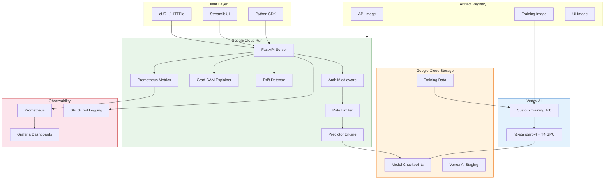
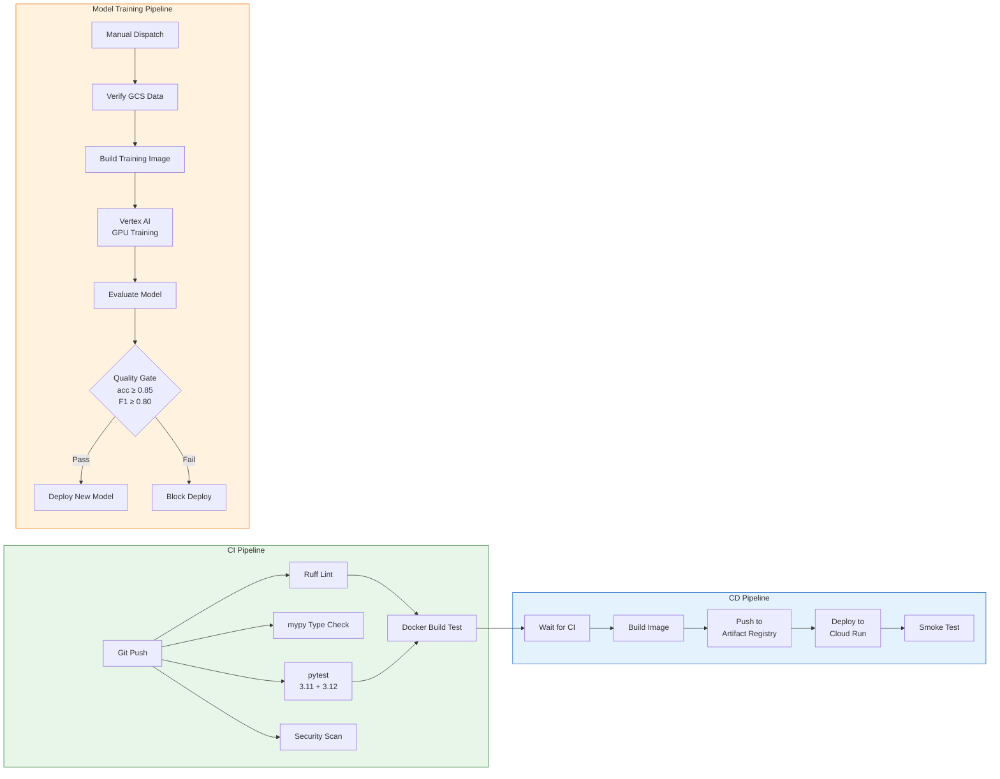
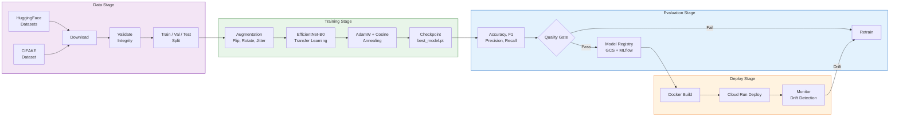
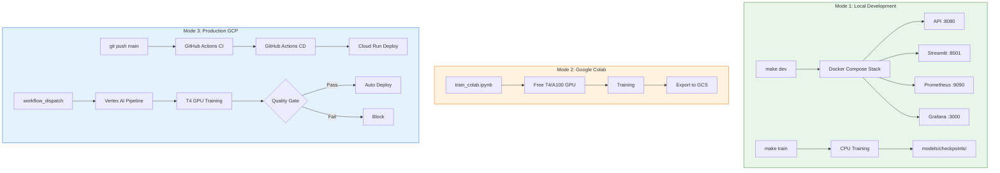
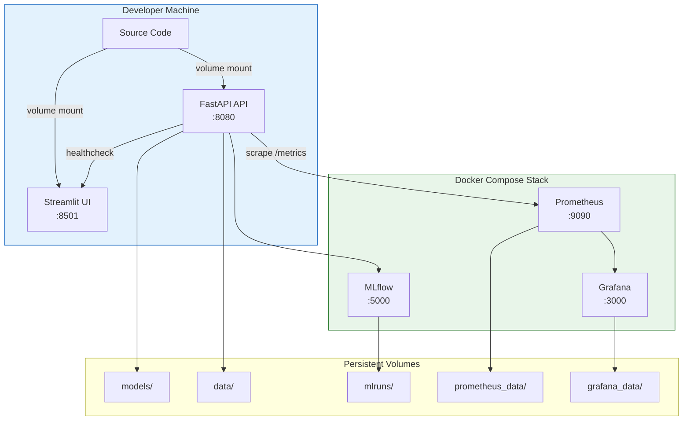
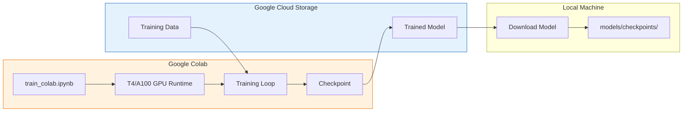
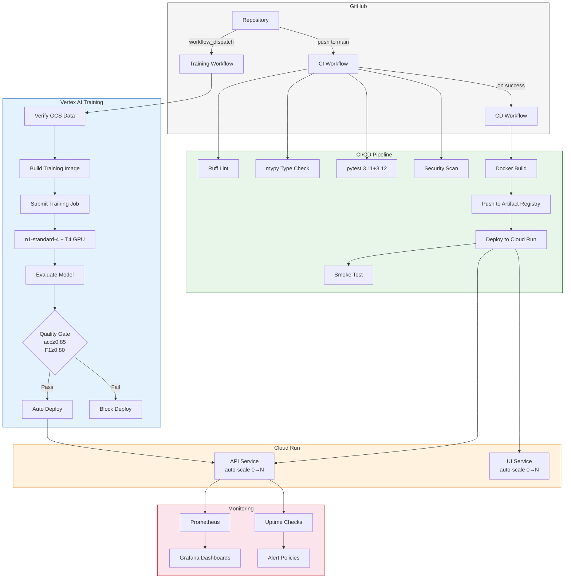

# Architecture Documentation

## System Overview

The AI Product Photo Detector is a production MLOps system for detecting AI-generated product images in e-commerce. It covers the full lifecycle: data versioning, GPU training with experiment tracking, CI/CD with automated deployment to Google Cloud Run, API serving, and real-time monitoring.

### High-Level Architecture



### CI/CD Pipeline Architecture



### ML Pipeline Architecture



---

## Development Modes

The project supports **three distinct development modes**, each optimized for different use cases:



### Mode Comparison

| Feature | Local Development | Google Colab | Production GCP |
|---------|-------------------|--------------|----------------|
| **Purpose** | Development, debugging, quick tests | Free GPU training experiments | Production deployment & training |
| **GPU** | CPU (or local GPU) | Free T4/A100 | Paid T4 (Vertex AI) |
| **Cost** | Free | Free | ~$0.10-0.50/training run |
| **Training Time** | 1-2h (CPU) | ~20 min (T4) | ~25 min (T4) |
| **Hot Reload** | Yes | No | No |
| **CI/CD** | Manual | Manual | Fully automated |
| **Monitoring** | Local Prometheus/Grafana | None | Cloud Monitoring |
| **Best For** | Daily development | Quick experiments | Production releases |

---

### Mode 1: Local Development (Docker Compose)

Full-stack local development with hot reload, debugging, and monitoring.

#### Architecture



#### Quick Start

```bash
# 1. Clone and setup
git clone https://github.com/nolancacheux/AI-Product-Photo-Detector.git
cd AI-Product-Photo-Detector

# 2. Install dependencies (includes pre-commit hooks)
make dev

# 3. Download dataset
make data

# 4. Start the full stack
make docker-up

# 5. Open services in browser
# API: http://localhost:8080
# Streamlit: http://localhost:8501
# MLflow: http://localhost:5000
# Prometheus: http://localhost:9090
# Grafana: http://localhost:3000 (admin/admin)
```

#### Services

| Service | Port | URL | Description |
|---------|------|-----|-------------|
| **API** | 8080 | http://localhost:8080 | FastAPI inference server with hot reload |
| **Streamlit UI** | 8501 | http://localhost:8501 | Drag-and-drop image analysis interface |
| **MLflow** | 5000 | http://localhost:5000 | Experiment tracking and model registry |
| **Prometheus** | 9090 | http://localhost:9090 | Metrics collection and alerting |
| **Grafana** | 3000 | http://localhost:3000 | Monitoring dashboards |

#### Development Commands

```bash
# Start/stop stack
make docker-up # Start all services
make docker-down # Stop all services
make docker-logs # Follow logs

# Dev environment with hot reload
make docker-dev # Start dev stack (docker-compose.dev.yml)
make docker-dev-down # Stop dev stack
make docker-dev-logs # Follow dev logs

# Code quality
make lint # Run ruff + mypy
make format # Auto-format code
make test # Run pytest with coverage

# Local training (CPU)
make train # Train with configs/train_config.yaml
make mlflow # View training experiments

# Direct API server (without Docker)
make serve # uvicorn with --reload on :8000
```

#### Local Training (CPU)

```bash
# Default configuration
python -m src.training.train --config configs/train_config.yaml

# Override hyperparameters
python -m src.training.train --config configs/train_config.yaml \
  --epochs 10 \
  --batch-size 32 \
  --learning-rate 0.0005

# With GCS upload after training
python -m src.training.train --config configs/train_config.yaml \
  --gcs-bucket ai-product-detector-487013
```

#### Environment Files

| File | Purpose |
|------|---------|
| `.env.development` | Development environment variables |
| `.env.production` | Production environment variables |
| `docker-compose.yml` | Base compose configuration |
| `docker-compose.dev.yml` | Dev overrides (hot reload, debug) |
| `docker-compose.prod.yml` | Prod overrides (optimized settings) |

---

### Mode 2: Google Colab (Free GPU Training)

Free GPU training using Google Colab's T4/A100 GPUs.

#### Architecture



#### Quick Start

1. **Open the notebook:**
   [](https://colab.research.google.com/github/nolancacheux/AI-Product-Photo-Detector/blob/main/notebooks/train_colab.ipynb)

2. **Select GPU runtime:**
   - Go to **Runtime → Change runtime type → T4 GPU** (or A100 if available)

3. **Configure and run:**
   - Set your GCS bucket name (optional, for model upload)
   - Adjust hyperparameters if needed
   - Run all cells

4. **Export the model:**
   - Download from Colab file browser, or
   - Auto-upload to GCS bucket

#### Notebook Sections

| Section | Description |
|---------|-------------|
| **1. Setup** | Install dependencies, authenticate GCS |
| **2. Data** | Download dataset from HuggingFace or mount GCS |
| **3. Model** | Initialize EfficientNet-B0 with pretrained weights |
| **4. Training** | Training loop with progress bars and metrics |
| **5. Evaluation** | Test set evaluation and confusion matrix |
| **6. Export** | Save checkpoint locally or upload to GCS |

#### Colab-Specific Configuration

```python
# In the notebook
CONFIG = {
    "epochs": 15,
    "batch_size": 64, # T4 can handle 64; reduce to 32 if OOM
    "learning_rate": 0.001,
    "image_size": 224,
    "gcs_bucket": "ai-product-detector-487013", # Optional
    "gcs_model_path": "models/colab_trained.pt",
}
```

#### Tips for Colab

| Issue | Solution |
|-------|----------|
| Session timeout | Save checkpoints to Google Drive periodically |
| OOM errors | Reduce batch_size to 32 or 16 |
| Slow data loading | Use HuggingFace datasets (pre-cached) |
| Need more GPU time | Use Colab Pro for longer sessions |

---

### Mode 3: Production GCP

Full production deployment with CI/CD, Vertex AI training, and Cloud Run serving.

#### Architecture



#### GitHub Actions Workflows

| Workflow | File | Trigger | Description |
|----------|------|---------|-------------|
| **CI** | `ci.yml` | Push/PR to `main` | Lint, type check, test, security scan |
| **CD** | `cd.yml` | Push to `main` + CI pass | Build, push, deploy to Cloud Run |
| **Model Training** | `model-training.yml` | Manual / data changes | Vertex AI GPU training pipeline |
| **PR Preview** | `pr-preview.yml` | PR open/update | Deploy preview environment |

#### CI Pipeline

```yaml
# Triggered on: push/PR to main
jobs:
  lint: ruff check src/ tests/
  typecheck: mypy src/ --strict
  test: pytest (Python 3.11 + 3.12 matrix)
  security: pip-audit + bandit
  docker: docker build --target test
```

#### CD Pipeline

```yaml
# Triggered on: push to main (after CI passes)
jobs:
  build:
    - Build Docker image
    - Push to Artifact Registry
  deploy:
    - Deploy to Cloud Run (API + UI)
    - Run smoke test on /health
```

#### Vertex AI Training Pipeline

```bash
# Manual trigger via GitHub Actions UI
gh workflow run model-training.yml \
  -f epochs=15 \
  -f batch_size=64 \
  -f auto_deploy=true

# Or via gcloud CLI
python -m src.training.vertex_submit \
  --epochs 15 \
  --batch-size 64 \
  --sync
```

**Pipeline stages:**

```
┌─────────────────┐ ┌─────────────────┐ ┌─────────────────┐
│ Verify Data │ → │ Build Image │ → │ Submit Job │
│ (GCS bucket) │ │ (Artifact Reg) │ │ (Vertex AI) │
└─────────────────┘ └─────────────────┘ └─────────────────┘
                                                      │
                                                      ▼
┌─────────────────┐ ┌─────────────────┐ ┌─────────────────┐
│ Auto Deploy │ ← │ Quality Gate │ ← │ Evaluate │
│ (if enabled) │ │ acc≥0.85 F1≥0.8│ │ (CPU runner) │
└─────────────────┘ └─────────────────┘ └─────────────────┘
```

#### Terraform Infrastructure

```
terraform/
├── environments/
│ ├── dev/ # Development (scale-to-zero, 512Mi)
│ │ ├── main.tf
│ │ ├── variables.tf
│ │ └── terraform.tfvars
│ └── prod/ # Production (min 1 instance, 1Gi)
│ ├── main.tf
│ ├── variables.tf
│ └── terraform.tfvars
└── modules/
    ├── cloud-run/ # Cloud Run service configuration
    ├── storage/ # GCS buckets with versioning
    ├── registry/ # Artifact Registry with cleanup
    ├── monitoring/ # Uptime checks, alert policies
    └── iam/ # Service accounts, IAM bindings
```

#### Cloud Run Configuration

| Setting | Dev | Prod |
|---------|-----|------|
| Min instances | 0 | 1 |
| Max instances | 2 | 10 |
| Memory | 512Mi | 1Gi |
| CPU | 1 | 2 |
| Timeout | 60s | 300s |
| Concurrency | 80 | 100 |

#### Monitoring Stack

| Component | Purpose |
|-----------|---------|
| **Prometheus** | Metrics collection from `/metrics` endpoint |
| **Grafana** | Pre-configured dashboards (auto-provisioned) |
| **Cloud Logging** | Structured JSON logs with request IDs |
| **Uptime Checks** | Health monitoring on `/healthz` |
| **Alert Policies** | Latency, error rate, availability alerts |
| **Budget Alerts** | Cost monitoring (50%, 80%, 100% thresholds) |

#### Production URLs

| Resource | URL |
|----------|-----|
| **REST API** | https://ai-product-detector-714127049161.europe-west1.run.app |
| **Web UI** | https://ai-product-detector-ui-714127049161.europe-west1.run.app |
| **Swagger Docs** | https://ai-product-detector-714127049161.europe-west1.run.app/docs |
| **Health Check** | https://ai-product-detector-714127049161.europe-west1.run.app/health |
| **Metrics** | https://ai-product-detector-714127049161.europe-west1.run.app/metrics |

---

## Project Structure

```
AI-Product-Photo-Detector/
├── .github/workflows/ # CI/CD pipelines
│ ├── ci.yml # Lint, type check, test, security scan
│ ├── cd.yml # Build, push, deploy to Cloud Run
│ ├── model-training.yml # Vertex AI GPU training pipeline
│ └── pr-preview.yml # PR preview deployments
├── src/
│ ├── data/ # Data download and validation
│ ├── inference/ # API server
│ │ ├── routes/ # API route handlers
│ │ │ ├── predict.py # /predict, /predict/batch, /predict/explain
│ │ │ ├── monitoring.py # /health, /healthz, /readyz, /metrics, /drift
│ │ │ ├── info.py # /, /privacy
│ │ │ └── v1/ # API v1 versioned routes
│ │ ├── api.py # FastAPI application
│ │ ├── predictor.py # Model loading and inference
│ │ ├── explainer.py # Grad-CAM heatmap generation
│ │ ├── auth.py # API key authentication
│ │ ├── validation.py # Input validation
│ │ ├── schemas.py # Pydantic request/response models
│ │ ├── shadow.py # Shadow model comparison (A/B testing)
│ │ ├── state.py # Application state management
│ │ └── rate_limit.py # Rate limiting configuration
│ ├── training/ # Model training
│ │ ├── train.py # Training loop with MLflow
│ │ ├── model.py # EfficientNet-B0 architecture
│ │ ├── dataset.py # PyTorch dataset with lazy loading
│ │ ├── augmentation.py # Data augmentation transforms
│ │ ├── gcs.py # GCS integration for models
│ │ └── vertex_submit.py # Vertex AI job submission
│ ├── pipelines/ # Pipeline orchestration
│ │ ├── evaluate.py # Model evaluation
│ │ └── training_pipeline.py # End-to-end training orchestrator
│ ├── monitoring/ # Observability
│ │ ├── metrics.py # Prometheus metrics
│ │ └── drift.py # Drift detection
│ ├── ui/ # Streamlit web interface
│ └── utils/ # Shared utilities
├── tests/ # Unit and integration tests
├── configs/ # Configuration files
│ ├── train_config.yaml # Training hyperparameters
│ ├── inference_config.yaml # API configuration
│ ├── pipeline_config.yaml # Pipeline configuration
│ ├── prometheus.yml # Prometheus scrape config
│ ├── prometheus/ # Prometheus alerting rules
│ └── grafana/ # Grafana dashboards and provisioning
├── docker/ # Dockerfiles
│ ├── Dockerfile # Production API image
│ ├── Dockerfile.training # Vertex AI GPU training image
│ ├── serve.Dockerfile # Serving-optimized image
│ ├── train.Dockerfile # Local training environment
│ └── ui.Dockerfile # Streamlit UI image
├── terraform/ # Infrastructure as Code
│ ├── environments/ # Per-environment configs (dev/prod)
│ └── modules/ # Reusable Terraform modules
├── scripts/ # Data download utilities
├── notebooks/ # Jupyter notebooks (Colab training)
│ └── train_colab.ipynb # Free T4/A100 GPU training
├── data/ # Local data directory (DVC tracked)
├── models/ # Model checkpoints
├── dvc.yaml # DVC pipeline definition
├── docker-compose.yml # Local development stack
├── Makefile # Development commands
└── pyproject.toml # Python dependencies
```

---

## Pipeline Stages

### 1. Data Pipeline

| Component | Technology | Purpose |
|-----------|------------|---------|
| Dataset | CIFAKE (CIFAR-10 + Stable Diffusion v1.4) | Real vs AI-generated image pairs |
| High-Res Dataset | HuggingFace Datasets | Production-quality training images |
| Version Control | DVC | Track dataset versions independently of Git |
| Remote Storage | Google Cloud Storage | Shared data/model store |
| Pipeline | `dvc.yaml` (download → validate → train) | Reproducible, cacheable pipeline stages |
| Validation | `src/data/validate.py` | Automated integrity checks with reporting |

**Data flow:**

```
HuggingFace/Kaggle → download script → data/processed/{train,val,test}/ → DVC → GCS Bucket
```

**DVC pipeline stages:**

```yaml
stages:
  download: # CIFAKE dataset → data/processed/
  validate: # Integrity checks → reports/data_validation.json
  train: # EfficientNet-B0 → models/checkpoints/best_model.pt
```

### 2. Training Pipeline

| Component | Technology | Purpose |
|-----------|------------|---------|
| Framework | PyTorch + timm | EfficientNet-B0 with ImageNet transfer learning |
| Augmentation | torchvision transforms | Horizontal flip, rotation, color jitter, random crop |
| Scheduler | Cosine annealing + warmup | Learning rate schedule with 2-epoch warmup |
| Tracking | MLflow | Log params, metrics, artifacts per run |
| Checkpointing | `models/checkpoints/best_model.pt` | Save best model by validation accuracy |
| Configuration | `configs/train_config.yaml` | Centralized hyperparameters |

**Training flow:**

```
data/processed/ → PyTorch Dataset → Augmentation → EfficientNet-B0 → MLflow logs → best_model.pt
```

**Training configuration:**

| Parameter | Value |
|-----------|-------|
| Architecture | EfficientNet-B0 (ImageNet pretrained) |
| Image size | 224 × 224 |
| Batch size | 64 |
| Epochs | 15 |
| Optimizer | AdamW, lr=0.001 |
| Scheduler | Cosine annealing with 2-epoch warmup |
| Early stopping | Patience: 5 epochs |

**Key files:**
- `src/training/train.py` — Training loop with MLflow integration
- `src/training/model.py` — EfficientNet-B0 architecture (binary classifier)
- `src/training/dataset.py` — PyTorch dataset with lazy loading
- `src/training/augmentation.py` — Data augmentation transforms

### Pipeline Orchestration

The `src/pipelines/` module provides higher-level pipeline stages:

| Component | File | Purpose |
|-----------|------|---------|
| Evaluation | `evaluate.py` | Model evaluation on test set with metrics reporting |
| Training Pipeline | `training_pipeline.py` | End-to-end orchestrator for the full training workflow |

### 3. CI/CD Pipeline

Four GitHub Actions workflows automate quality, training, and deployment:

| Workflow | File | Trigger | Jobs |
|----------|------|---------|------|
| **CI** | `ci.yml` | Push / PR to `main` | Lint, type check, test (3.11 + 3.12), security scan, Docker build |
| **CD** | `cd.yml` | Push to `main` / manual | Wait CI → build image → push to Artifact Registry → deploy Cloud Run → smoke test |
| **Model Training** | `model-training.yml` | Manual / data changes | Verify data → build training image → Vertex AI GPU → evaluate → quality gate → deploy |
| **PR Preview** | `pr-preview.yml` | PR open/update | Deploy preview environment for testing |

**CI/CD flow:**

```
git push → GitHub Actions → ruff + mypy + pytest → Docker build → Artifact Registry → Cloud Run → Health check
```

**Vertex AI training flow:**

```
Trigger → Verify GCS Data → Build Training Image → Vertex AI (n1-standard-4 + T4 GPU) → Evaluate → Quality Gate (acc ≥ 0.85, F1 ≥ 0.80) → Deploy to Cloud Run
```

### 4. Inference / Serving

| Component | Technology | Purpose |
|-----------|------------|---------|
| Framework | FastAPI + Uvicorn | Async REST API with versioning |
| Deployment | Google Cloud Run | Serverless, auto-scaling (0→N) |
| Local | Docker Compose | Multi-service local development |
| UI | Streamlit | Interactive web interface for testing |
| Auth | API key (`X-API-Key` header) | HMAC-based constant-time comparison |
| Rate Limiting | slowapi | Per-endpoint configurable limits |

**Request flow:**

```
Client → FastAPI → Auth → Rate Limit → Validate Image → Preprocess (224×224) → EfficientNet-B0 → JSON Response
```

**API endpoints:**

| Endpoint | Method | Description | Rate Limit |
|----------|--------|-------------|------------|
| `/predict` | POST | Single image classification | 30/min |
| `/predict/batch` | POST | Batch (up to 10 images) | 5/min |
| `/predict/explain` | POST | Prediction + Grad-CAM heatmap | 10/min |
| `/health` | GET | Detailed health check with metrics | — |
| `/healthz` | GET | Liveness probe (process alive) | — |
| `/readyz` | GET | Readiness probe (model loaded) | — |
| `/startup` | GET | Startup probe (model loading complete) | — |
| `/metrics` | GET | Prometheus metrics | — |
| `/drift` | GET | Drift detection status | — |
| `/privacy` | GET | Privacy policy | — |

**API versioning:**
- All endpoints are available at both root (`/predict`) and versioned (`/v1/predict`)
- Backward-compatible root routes maintained for existing clients

**Key files:**
- `src/inference/api.py` — FastAPI application and middleware
- `src/inference/routes/predict.py` — Prediction endpoints
- `src/inference/routes/monitoring.py` — Health and metrics endpoints
- `src/inference/predictor.py` — Model loading, preprocessing, inference
- `src/inference/schemas.py` — Pydantic request/response models
- `src/inference/auth.py` — API key authentication (HMAC, constant-time)
- `src/inference/validation.py` — Input validation (file type, size)
- `src/inference/explainer.py` — Grad-CAM heatmap generation
- `src/inference/shadow.py` — Shadow model comparison (A/B testing)

### 5. Monitoring & Observability

| Component | Technology | Purpose |
|-----------|------------|---------|
| Metrics | prometheus_client | 12+ custom metrics at `/metrics` |
| Dashboards | Grafana | Auto-provisioned dashboards |
| Logging | structlog (JSON) | Structured, machine-readable logs with request IDs |
| Drift Detection | Sliding window analysis | Detect prediction distribution shifts |

**Prometheus metrics:**

| Metric | Type | Description |
|--------|------|-------------|
| `aidetect_predictions_total` | Counter | Total predictions by status/class/confidence |
| `aidetect_prediction_latency_seconds` | Histogram | Per-prediction latency distribution |
| `aidetect_prediction_probability` | Histogram | Probability score distribution |
| `aidetect_batch_predictions_total` | Counter | Batch request count |
| `aidetect_batch_size` | Histogram | Images per batch request |
| `aidetect_batch_latency_seconds` | Histogram | Batch processing time |
| `aidetect_image_validation_errors_total` | Counter | Validation errors by type |
| `aidetect_model_loaded` | Gauge | Model load status (0/1) |
| `aidetect_request_size_bytes` | Histogram | Request payload size |
| `aidetect_response_size_bytes` | Histogram | Response payload size |
| `http_request_duration_seconds` | Histogram | HTTP latency by endpoint |
| `http_requests_total` | Counter | HTTP requests by method/endpoint/status |

**Drift detection:**
- Sliding window over the last 1,000 predictions
- Tracks: mean probability, confidence distribution, class ratios
- Configurable alerting threshold
- Status exposed at `GET /drift`

**Logging example:**

```json
{
  "event": "prediction_complete",
  "prediction": "ai_generated",
  "probability": 0.87,
  "latency_ms": 45.2,
  "request_id": "abc-123",
  "timestamp": "2024-01-15T10:30:00Z"
}
```

---

## Docker Architecture

```
docker/
├── Dockerfile # Production API image (CPU PyTorch, non-root)
├── Dockerfile.training # Vertex AI GPU training image
├── serve.Dockerfile # Serving-optimized image
├── train.Dockerfile # Local training environment
└── ui.Dockerfile # Streamlit UI image
```

**Docker Compose services:**

| Service | Port | Dependencies |
|---------|------|-------------|
| `api` (FastAPI) | 8080 | — |
| `ui` (Streamlit) | 8501 | api (healthy) |
| `mlflow` (Tracking) | 5000 | — |
| `prometheus` (Metrics) | 9090 | api (healthy) |
| `grafana` (Dashboards) | 3000 | prometheus |

All services share a `detector-network` bridge network. The API container mounts `models/` and `configs/` as read-only volumes.

---

## Infrastructure (Terraform)

The Terraform configuration uses a modular architecture with per-environment
configurations:

```
terraform/
├── environments/ # Per-environment configurations
│ ├── dev/ # Development (scale-to-zero, 512Mi, 10€ budget)
│ └── prod/ # Production (min 1 instance, 1Gi, 50€ budget)
└── modules/ # Reusable infrastructure modules
    ├── cloud-run/ # Cloud Run service
    ├── storage/ # GCS buckets
    ├── registry/ # Artifact Registry
    ├── monitoring/ # Uptime checks, alerts
    └── iam/ # Service accounts
```

**Provisioned resources:**

| Resource | Module | Purpose |
|----------|--------|---------|
| GCS Bucket | `storage` | DVC data & model storage (versioned) |
| Artifact Registry | `registry` | Docker image registry with cleanup |
| Cloud Run Service | `cloud-run` | Serverless API (auto-scaling, health probes) |
| Service Account | `iam` | Least-privilege identity for Cloud Run |
| Monitoring | `monitoring` | Uptime checks, alerting (prod only) |
| Budget Alert | (environment) | Monthly spend alerts (50%, 80%, 100%) |

**Environment differences:**

| Setting | Dev | Prod |
|---------|-----|------|
| Min instances | 0 | 1 |
| Max instances | 2 | 10 |
| Memory | 512Mi | 1Gi |
| Budget | 10€/month | 50€/month |
| Monitoring | Optional | Always enabled |

See [INFRASTRUCTURE.md](INFRASTRUCTURE.md) for full details.
