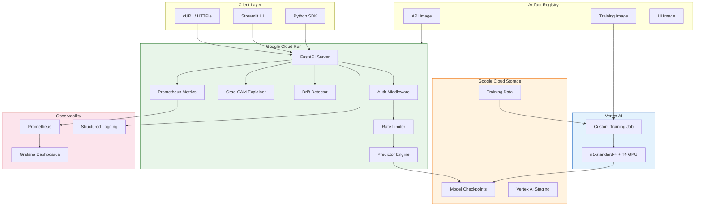
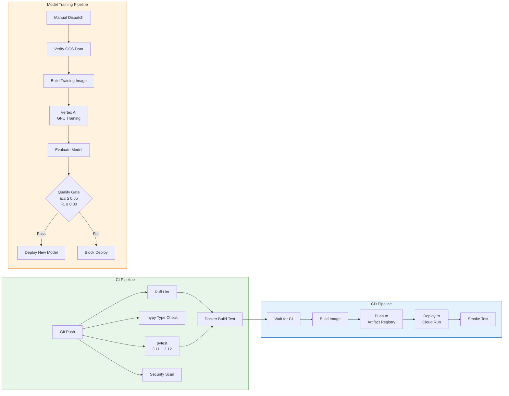
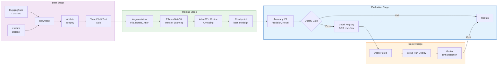

# Architecture Documentation

## System Overview

The AI Product Photo Detector is a production MLOps system for detecting AI-generated product images in e-commerce. It covers the full lifecycle: data versioning, GPU training with experiment tracking, CI/CD with automated deployment to Google Cloud Run, API serving, and real-time monitoring.

### High-Level Architecture



### CI/CD Pipeline Architecture



### ML Pipeline Architecture



---

## Pipeline Stages

### 1. Data Pipeline

| Component | Technology | Purpose |
|-----------|------------|---------|
| Dataset | CIFAKE (CIFAR-10 + Stable Diffusion v1.4) | Real vs AI-generated image pairs |
| High-Res Dataset | HuggingFace Datasets | Production-quality training images |
| Version Control | DVC | Track dataset versions independently of Git |
| Remote Storage | Google Cloud Storage | Shared data/model store |
| Pipeline | `dvc.yaml` (download → validate → train) | Reproducible, cacheable pipeline stages |
| Validation | `src/data/validate.py` | Automated integrity checks with reporting |

**Data flow:**

```
HuggingFace/Kaggle → download script → data/processed/{train,val,test}/ → DVC → GCS Bucket
```

**DVC pipeline stages:**

```yaml
stages:
  download:   # CIFAKE dataset → data/processed/
  validate:   # Integrity checks → reports/data_validation.json
  train:      # EfficientNet-B0 → models/checkpoints/best_model.pt
```

### 2. Training Pipeline

| Component | Technology | Purpose |
|-----------|------------|---------|
| Framework | PyTorch + timm | EfficientNet-B0 with ImageNet transfer learning |
| Augmentation | torchvision transforms | Horizontal flip, rotation, color jitter, random crop |
| Scheduler | Cosine annealing + warmup | Learning rate schedule with 2-epoch warmup |
| Tracking | MLflow | Log params, metrics, artifacts per run |
| Checkpointing | `models/checkpoints/best_model.pt` | Save best model by validation accuracy |
| Configuration | `configs/train_config.yaml` | Centralized hyperparameters |

**Training flow:**

```
data/processed/ → PyTorch Dataset → Augmentation → EfficientNet-B0 → MLflow logs → best_model.pt
```

**Training configuration:**

| Parameter | Value |
|-----------|-------|
| Architecture | EfficientNet-B0 (ImageNet pretrained) |
| Image size | 224 × 224 |
| Batch size | 64 |
| Epochs | 15 |
| Optimizer | AdamW, lr=0.001 |
| Scheduler | Cosine annealing with 2-epoch warmup |
| Early stopping | Patience: 5 epochs |

**Key files:**
- `src/training/train.py` — Training loop with MLflow integration
- `src/training/model.py` — EfficientNet-B0 architecture (binary classifier)
- `src/training/dataset.py` — PyTorch dataset with lazy loading
- `src/training/augmentation.py` — Data augmentation transforms

### Pipeline Orchestration

The `src/pipelines/` module provides higher-level pipeline stages:

| Component | File | Purpose |
|-----------|------|---------|
| Evaluation | `evaluate.py` | Model evaluation on test set with metrics reporting |
| Training Pipeline | `training_pipeline.py` | End-to-end orchestrator for the full training workflow |

### 3. CI/CD Pipeline

Three GitHub Actions workflows automate quality, training, and deployment:

| Workflow | Trigger | Jobs |
|----------|---------|------|
| **CI** (`ci.yml`) | Push / PR to `main` | Lint, type check, test (3.11 + 3.12), security scan, Docker build |
| **CD** (`cd.yml`) | Push to `main` / manual | Wait CI → build image → push to Artifact Registry → deploy Cloud Run → smoke test |
| **Model Training** (`model-training.yml`) | Manual / data changes | Verify data → build training image → Vertex AI GPU → evaluate → quality gate → deploy |

**CI/CD flow:**

```
git push → GitHub Actions → ruff + mypy + pytest → Docker build → Artifact Registry → Cloud Run → Health check
```

**Vertex AI training flow:**

```
Trigger → Verify GCS Data → Build Training Image → Vertex AI (n1-standard-4 + T4 GPU) → Evaluate → Quality Gate (acc ≥ 0.85, F1 ≥ 0.80) → Deploy to Cloud Run
```

### 4. Inference / Serving

| Component | Technology | Purpose |
|-----------|------------|---------|
| Framework | FastAPI + Uvicorn | Async REST API |
| Deployment | Google Cloud Run | Serverless, auto-scaling (0→N) |
| Local | Docker Compose | Multi-service local development |
| UI | Streamlit | Interactive web interface for testing |
| Auth | API key (`X-API-Key` header) | HMAC-based constant-time comparison |
| Rate Limiting | slowapi | Per-endpoint configurable limits |

**Request flow:**

```
Client → FastAPI → Auth → Rate Limit → Validate Image → Preprocess (224×224) → EfficientNet-B0 → JSON Response
```

**API endpoints:**

| Endpoint | Method | Description | Rate Limit |
|----------|--------|-------------|------------|
| `/predict` | POST | Single image classification | 30/min |
| `/predict/batch` | POST | Batch (up to 10 images) | 5/min |
| `/predict/explain` | POST | Prediction + Grad-CAM heatmap | 10/min |
| `/health` | GET | Readiness probe | — |
| `/healthz` | GET | Liveness probe | — |
| `/metrics` | GET | Prometheus metrics | — |
| `/drift` | GET | Drift detection status | — |
| `/privacy` | GET | Privacy policy | — |

**Key files:**
- `src/inference/api.py` — FastAPI application and endpoint definitions
- `src/inference/predictor.py` — Model loading, preprocessing, inference
- `src/inference/schemas.py` — Pydantic request/response models
- `src/inference/auth.py` — API key authentication (HMAC, constant-time)
- `src/inference/validation.py` — Input validation (file type, size)
- `src/inference/explainer.py` — Grad-CAM heatmap generation
- `src/inference/shadow.py` — Shadow model comparison (A/B testing)

### 5. Monitoring & Observability

| Component | Technology | Purpose |
|-----------|------------|---------|
| Metrics | prometheus_client | 12+ custom metrics at `/metrics` |
| Dashboards | Grafana | Auto-provisioned dashboards |
| Logging | structlog (JSON) | Structured, machine-readable logs with request IDs |
| Drift Detection | Sliding window analysis | Detect prediction distribution shifts |

**Prometheus metrics:**

| Metric | Type | Description |
|--------|------|-------------|
| `aidetect_predictions_total` | Counter | Total predictions by status/class/confidence |
| `aidetect_prediction_latency_seconds` | Histogram | Per-prediction latency distribution |
| `aidetect_prediction_probability` | Histogram | Probability score distribution |
| `aidetect_batch_predictions_total` | Counter | Batch request count |
| `aidetect_batch_size` | Histogram | Images per batch request |
| `aidetect_batch_latency_seconds` | Histogram | Batch processing time |
| `aidetect_image_validation_errors_total` | Counter | Validation errors by type |
| `aidetect_model_loaded` | Gauge | Model load status (0/1) |
| `aidetect_request_size_bytes` | Histogram | Request payload size |
| `aidetect_response_size_bytes` | Histogram | Response payload size |
| `http_request_duration_seconds` | Histogram | HTTP latency by endpoint |
| `http_requests_total` | Counter | HTTP requests by method/endpoint/status |

**Drift detection:**
- Sliding window over the last 1,000 predictions
- Tracks: mean probability, confidence distribution, class ratios
- Configurable alerting threshold
- Status exposed at `GET /drift`

**Logging example:**

```json
{
  "event": "prediction_complete",
  "prediction": "ai_generated",
  "probability": 0.87,
  "latency_ms": 45.2,
  "request_id": "abc-123",
  "timestamp": "2024-01-15T10:30:00Z"
}
```

---

## Docker Architecture

```
docker/
├── Dockerfile              # Production API image (CPU PyTorch, non-root)
├── Dockerfile.training     # Vertex AI GPU training image
├── serve.Dockerfile        # Serving-optimized image
├── train.Dockerfile        # Local training environment
└── ui.Dockerfile           # Streamlit UI image
```

**Docker Compose services:**

| Service | Port | Dependencies |
|---------|------|-------------|
| `api` (FastAPI) | 8080 | — |
| `ui` (Streamlit) | 8501 | api (healthy) |
| `mlflow` (Tracking) | 5000 | — |
| `prometheus` (Metrics) | 9090 | api (healthy) |
| `grafana` (Dashboards) | 3000 | prometheus |

All services share a `detector-network` bridge network. The API container mounts `models/` and `configs/` as read-only volumes.

---

## Infrastructure (Terraform)

```
terraform/
├── main.tf                     # GCS + Artifact Registry + Cloud Run + IAM + Budget
├── variables.tf                # Configurable inputs
├── outputs.tf                  # Cloud Run URL, bucket name
└── terraform.tfvars.example    # Example variable values
```

**Provisioned resources:**

| Resource | Type | Purpose |
|----------|------|---------|
| GCS Bucket | `google_storage_bucket` | DVC data & model storage (versioned) |
| Artifact Registry | `google_artifact_registry_repository` | Docker image registry |
| Cloud Run Service | `google_cloud_run_v2_service` | Serverless API (auto-scaling, health probes) |
| Service Account | `google_service_account` | Least-privilege identity for Cloud Run |
| IAM Bindings | `google_project_iam_member` | Storage, logging, monitoring roles |
| Budget Alert | `google_billing_budget` | Monthly spend alerts (50%, 80%, 100%) |
| Public Access | `google_cloud_run_v2_service_iam_member` | Unauthenticated API access |

**Configuration:**

| Variable | Description | Default |
|----------|-------------|---------|
| `API_KEYS` | Comma-separated API keys | (auth disabled) |
| `REQUIRE_AUTH` | Enforce authentication | `false` |
| `LOG_LEVEL` | Logging level | `INFO` |
| `MODEL_PATH` | Path to model checkpoint | `models/checkpoints/best_model.pt` |
| `PORT` | Server port | `8080` |
| `ENVIRONMENT` | Deployment environment | `dev` |
| `GCS_BUCKET` | GCS bucket name | Set by Terraform |

---

## Deployment Modes

### Local Development

```bash
# API only (with hot reload)
make serve              # → http://localhost:8000

# Full stack (Docker Compose)
make docker-up          # API + UI + MLflow + Prometheus + Grafana
make docker-logs        # Follow logs
make docker-down        # Tear down
```

### Production (Cloud Run)

```bash
# Automated: push to main triggers CI → CD → deploy
git push origin main

# Manual deploy
make deploy
# or: gh workflow run cd.yml -f image_tag=latest

# Rollback to specific version
gh workflow run cd.yml -f image_tag=<commit-sha>

# Terraform provisioning
cd terraform
terraform init && terraform plan && terraform apply
```
