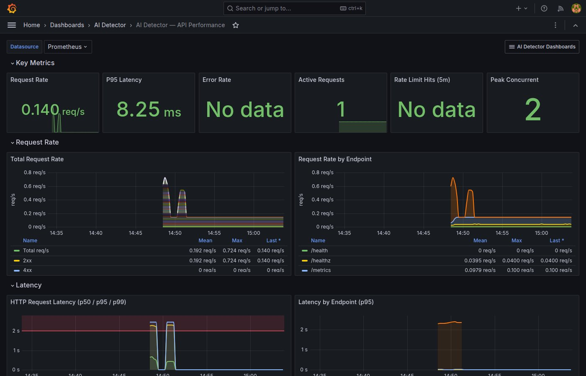
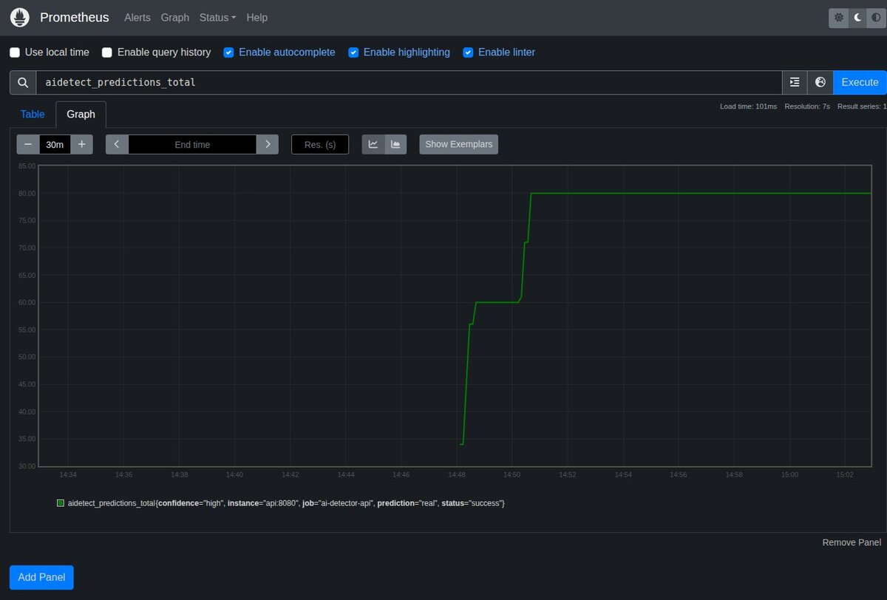
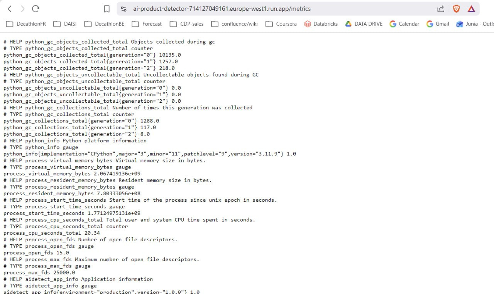

# Monitoring Stack Documentation

## Overview

The AI Product Photo Detector uses a production-grade observability stack built on **Prometheus** + **Grafana**, with custom application metrics exposed via `prometheus_client`.

### Architecture

```
┌─────────────┐     scrape /metrics     ┌──────────────┐     query      ┌─────────────┐
│  API Server  │ <─────────────────────── │  Prometheus  │ <───────────── │   Grafana    │
│  (FastAPI)   │                          │  v2.53.0     │                │  v11.1.0    │
│  :8080       │                          │  :9090       │                │  :3000      │
└─────────────┘                          └──────────────┘                └─────────────┘
       │                                         │
       │ expose metrics                          │ evaluate
       │ + /drift REST endpoint                  ▼
       ▼                                  ┌──────────────┐
  prometheus_client                       │   Alerting    │
  (Counter, Gauge,                        │    Rules      │
   Histogram, Info)                       └──────────────┘
```

### Screenshots

| Component | Screenshot |
|-----------|------------|
| Grafana Dashboard |  |
| Prometheus UI |  |
| Production Metrics |  |

---

## Metrics Inventory

All custom metrics are prefixed with `aidetect_`.

### Application Metrics

| Metric | Type | Labels | Description |
|--------|------|--------|-------------|
| `aidetect_app_info` | Info | `version`, `environment` | Application version and environment |
| `aidetect_model_info` | Info | `name`, `version`, `architecture`, `parameters` | Model metadata |
| `aidetect_model_loaded` | Gauge | - | Whether the model is loaded (0/1) |
| `aidetect_model_load_seconds` | Gauge | - | Time taken to load the model |

### Prediction Metrics

| Metric | Type | Labels | Description |
|--------|------|--------|-------------|
| `aidetect_predictions_total` | Counter | `status`, `prediction`, `confidence` | Total predictions |
| `aidetect_prediction_latency_seconds` | Histogram | - | Prediction inference latency |
| `aidetect_prediction_probability` | Histogram | - | Distribution of prediction probabilities |
| `aidetect_batch_predictions_total` | Counter | `status` | Total batch prediction requests |
| `aidetect_batch_size` | Histogram | - | Number of images per batch |
| `aidetect_batch_latency_seconds` | Histogram | - | Batch prediction latency |

### HTTP Metrics

| Metric | Type | Labels | Description |
|--------|------|--------|-------------|
| `aidetect_http_requests_total` | Counter | `method`, `endpoint`, `status_code` | Total HTTP requests |
| `aidetect_http_request_duration_seconds` | Histogram | `method`, `endpoint` | Request duration |
| `aidetect_request_size_bytes` | Histogram | - | Request body size |
| `aidetect_response_size_bytes` | Histogram | - | Response body size |
| `aidetect_active_requests` | Gauge | - | Currently processing requests |
| `aidetect_concurrent_requests_max` | Gauge | - | High watermark of concurrent requests |
| `aidetect_rate_limit_exceeded_total` | Counter | `endpoint` | Rate limit violations (not yet wired) |

### Error Metrics

| Metric | Type | Labels | Description |
|--------|------|--------|-------------|
| `aidetect_errors_total` | Counter | `type`, `endpoint` | Application errors |
| `aidetect_image_validation_errors_total` | Counter | `error_type` | Image validation failures |

### Image Metrics

| Metric | Type | Labels | Description |
|--------|------|--------|-------------|
| `aidetect_image_size_bytes` | Histogram | - | Uploaded image file sizes (not yet wired) |
| `aidetect_image_dimension_pixels` | Histogram | - | Image dimensions, max side (not yet wired) |

### Drift Monitoring

Drift detection is implemented via the `DriftDetector` class (`src/monitoring/drift.py`) and exposed through the **`/drift` REST endpoint**, not as a Prometheus metric. The detector uses a sliding window of recent predictions to compute:

- Mean prediction probability
- Low-confidence prediction ratio
- Prediction class distribution (AI vs Real)
- Drift score (0-1) computed against an optional baseline

The alerting rules reference `aidetect_drift_score` as a Prometheus gauge, but this metric is not currently exported to the Prometheus registry. Drift alerts therefore require the metric to be wired up (see "Known Gaps" below).

### Process Metrics (automatic via prometheus_client)

| Metric | Type | Description |
|--------|------|-------------|
| `process_resident_memory_bytes` | Gauge | RSS memory |
| `process_virtual_memory_bytes` | Gauge | Virtual memory |
| `process_cpu_seconds_total` | Counter | Total CPU time |
| `process_open_fds` | Gauge | Open file descriptors |
| `process_max_fds` | Gauge | Maximum file descriptors |
| `process_start_time_seconds` | Gauge | Process start timestamp |
| `python_gc_collections_total` | Counter | GC collections by generation |
| `python_gc_objects_collected_total` | Counter | GC objects collected |
| `python_info` | Info | Python version |

### Known Gaps

The following metrics are defined in `src/monitoring/metrics.py` but not yet instrumented in the application code:

| Metric | Status |
|--------|--------|
| `aidetect_model_load_seconds` | Defined, not wired |
| `aidetect_image_size_bytes` | Defined, not wired |
| `aidetect_image_dimension_pixels` | Defined, not wired |
| `aidetect_rate_limit_exceeded_total` | Defined, not wired |
| `aidetect_drift_score` (Prometheus gauge) | Not defined; drift is exposed via `/drift` REST endpoint only |
| `record_batch_prediction()` helper | Defined, not called from batch route |

---

## Dashboards

Four Grafana dashboards are provisioned automatically via file-based provisioning:

### 1. Combined Overview (`ai-detector.json`)

High-level overview dashboard combining key signals from API, model, and infrastructure.

### 2. API Performance (`api-dashboard.json`)

**Focus:** HTTP-level service health

- **Key Metrics row:** Request rate, P95 latency, error rate, active requests, rate limit hits, peak concurrent
- **Request Rate:** Total request rate with 2xx/4xx/5xx breakdown, request rate by endpoint
- **Latency:** HTTP request latency percentiles (p50/p95/p99) with 2s SLO threshold, latency by endpoint
- **Errors and Rate Limiting:** Error rate percentage with 5% threshold, errors by type, rate limit hits by endpoint
- **Response Size:** Response size distribution, HTTP status code distribution
- **Request and Image Size:** Request body sizes, uploaded image sizes

### 3. Model Performance (`model-dashboard.json`)

**Focus:** ML model inference and drift monitoring

- **Model Overview:** Status, version/architecture, load time, total predictions, predictions/min, batch count
- **Prediction Throughput:** Predictions per minute (success/error), AI vs Real classification rate
- **Confidence and Distribution:** Prediction confidence quantiles (p10-p90), AI vs Real pie chart, confidence level pie chart
- **Drift Monitoring:** Current drift score gauge (green/yellow/orange/red), drift score timeline with 0.15 threshold
- **Batch Predictions:** Batch vs single rate, batch size distribution, batch latency percentiles
- **Prediction Latency:** Inference latency (p50/p95/p99), image dimension distribution

### 4. Infrastructure (`infrastructure-dashboard.json`)

**Focus:** Runtime and system health

- **Service Health:** Service status, uptime, RSS memory, CPU usage, open FDs, max FDs
- **Memory:** Process memory (RSS + virtual), memory growth rate (leak detection)
- **CPU:** CPU usage with 80% threshold, Python threads
- **Garbage Collection:** GC collections by generation (0/1/2), objects collected rate
- **File Descriptors:** Open vs max FDs, FD usage percentage with 80% threshold
- **Scrape Health:** Prometheus scrape duration, samples scraped count

---

## Alerting Rules

Alerts are defined in `configs/prometheus/alerting-rules.yml` and organized in three groups:

### API Alerts (`ai-detector-api`)

| Alert | Condition | Duration | Severity |
|-------|-----------|----------|----------|
| **HighErrorRate** | 5xx rate > 5% | 5 min | critical |
| **HighLatency** | P95 > 2s | 5 min | critical |
| **ServiceDown** | `up == 0` | 1 min | critical |
| **HighRateLimiting** | Rate limit hits > 1/s | 5 min | warning |

### Model Alerts (`ai-detector-model`)

| Alert | Condition | Duration | Severity |
|-------|-----------|----------|----------|
| **DriftDetected** | Drift score > 0.15 | 10 min | warning |
| **DriftCritical** | Drift score > 0.30 | 5 min | critical |
| **ModelNotLoaded** | Model loaded == 0 | 2 min | critical |
| **HighPredictionErrorRate** | Prediction errors > 10% | 5 min | warning |

> **Note:** The DriftDetected and DriftCritical alerts reference `aidetect_drift_score`, which is not currently exported as a Prometheus metric. These alerts will not fire until the metric is wired up (see "Known Gaps" above).

### Infrastructure Alerts (`ai-detector-infrastructure`)

| Alert | Condition | Duration | Severity |
|-------|-----------|----------|----------|
| **HighMemoryUsage** | RSS > 80% of 2GB | 5 min | warning |
| **MemoryLeakSuspected** | RSS growing > 1MB/s for 30min | 30 min | warning |
| **HighFileDescriptorUsage** | FD usage > 80% | 5 min | warning |
| **HighCPUUsage** | CPU > 0.8 cores | 10 min | warning |
| **PrometheusTargetDown** | Scrape target unreachable | 30s | critical |

---

## Configuration Files

```
configs/
├── prometheus.yml                          # Prometheus scrape config
├── prometheus/
│   └── alerting-rules.yml                  # Alerting rules (3 groups, 13 rules)
└── grafana/
    ├── dashboards/
    │   ├── ai-detector.json                # Combined overview dashboard
    │   ├── api-dashboard.json              # API performance dashboard
    │   ├── model-dashboard.json            # Model performance dashboard
    │   └── infrastructure-dashboard.json   # Infrastructure dashboard
    └── provisioning/
        ├── datasources/
        │   └── prometheus.yml              # Prometheus datasource (http://prometheus:9090)
        └── dashboards/
            └── default.yml                 # Dashboard provisioning (two providers)
```

### Prometheus Configuration

From `configs/prometheus.yml`:

- **Global scrape interval:** 15s
- **Evaluation interval:** 15s
- **TSDB retention:** 15 days (`--storage.tsdb.retention.time=15d`)
- **Lifecycle API:** Enabled (`--web.enable-lifecycle`) for runtime config reload
- **API scrape job** (`ai-detector-api`): targets `api:8080`, scrape interval 10s, timeout 5s
- **Self-monitoring job** (`prometheus`): targets `localhost:9090`

### Grafana Configuration

- **Image:** `grafana/grafana:11.1.0`
- **Sign-up disabled:** `GF_USERS_ALLOW_SIGN_UP=false`
- **Datasource:** Prometheus at `http://prometheus:9090` (default, proxy mode)
- **Dashboard provisioning:** Two providers, both writing to the "AI Detector" folder

---

## Quick Start

### Local Development

```bash
# Start the full monitoring stack
docker compose up -d prometheus grafana api

# Access dashboards
open http://localhost:3000  # Grafana (admin/admin)
open http://localhost:9090  # Prometheus UI

# Check metrics endpoint directly
curl http://localhost:8080/metrics

# Check drift status (REST endpoint)
curl http://localhost:8080/drift
```

### Verifying Metrics

```bash
# Check that the API is exposing metrics
curl -s http://localhost:8080/metrics | grep "aidetect_"

# Check Prometheus targets
curl -s http://localhost:9090/api/v1/targets | python -m json.tool

# Check active alerts
curl -s http://localhost:9090/api/v1/alerts | python -m json.tool

# Reload Prometheus config at runtime (lifecycle API enabled)
curl -X POST http://localhost:9090/-/reload
```

### Testing Alerts

```bash
# Simulate load to trigger HighLatency
for i in $(seq 1 100); do
  curl -X POST http://localhost:8080/predict \
    -F "file=@test_image.jpg" &
done

# Check firing alerts
curl -s http://localhost:9090/api/v1/alerts | jq '.data.alerts[] | select(.state=="firing")'
```

---

## Adding New Metrics

1. Define the metric in `src/monitoring/metrics.py`:
   ```python
   MY_METRIC = Counter(
       "aidetect_my_metric_total",
       "Description of metric",
       ["label1", "label2"],
   )
   ```

2. Instrument the code:
   ```python
   from src.monitoring.metrics import MY_METRIC
   MY_METRIC.labels(label1="value", label2="value").inc()
   ```

3. Add a panel in the relevant Grafana dashboard JSON under `configs/grafana/dashboards/`.

4. If needed, add an alerting rule in `configs/prometheus/alerting-rules.yml`.

---

## Troubleshooting

### Metrics not appearing in Prometheus

1. Verify the API is running: `curl http://api:8080/health`
2. Check Prometheus targets: `http://localhost:9090/targets`
3. Verify the scrape config in `configs/prometheus.yml`
4. Check for label cardinality issues: too many unique label combinations can cause scrape failures

### Dashboard shows "No Data"

1. Check the datasource is configured (Grafana > Settings > Data Sources)
2. Verify the time range includes data (try "Last 5 minutes")
3. Run the PromQL query directly in Prometheus UI
4. Check that `$datasource` template variable is set

### Alerts not firing

1. Verify rules are loaded: `http://localhost:9090/rules`
2. Check the rule evaluation status for errors
3. Ensure the `for` duration has elapsed
4. Test the PromQL expression directly in Prometheus UI
5. For drift alerts specifically: confirm `aidetect_drift_score` is being exported (see "Known Gaps")

### Drift endpoint returns empty data

1. The `/drift` endpoint requires predictions to have been made first (sliding window)
2. At least `window_size / 2` predictions are needed for baseline saving
3. Without a baseline file, drift score will always be 0.0
