<!-- _class: title -->

# AI Product Photo Detector

## Production-Grade MLOps System for AI-Generated Image Detection

**Nolan Cacheux** | Master 2 Data Science, JUNIA ISEN Lille

`Python 3.11` | `PyTorch` | `FastAPI` | `Docker` | `DVC` | `Terraform` | `GCP`

---


# Context and Problem Statement

### The Rise of AI-Generated Product Photos

Generative AI tools (Midjourney, DALL-E 3, Stable Diffusion) now produce photorealistic product images indistinguishable from real photographs.

- **Consumer Trust Erosion** -- AI-generated images misrepresent items, causing returns and loss of confidence
- **Marketplace Integrity** -- Sellers using AI photos gain unfair advantages without detection
- **Scale of the Problem** -- Millions of listings uploaded daily; manual review is impossible
- **Current Gap** -- No production-ready solution combines classification, explainability, and full MLOps

**This project fills that gap**: a complete system that classifies images as Real or AI-Generated, explains decisions visually, and operates reliably at scale on GCP.

---


# Project Objectives

### Five Core Goals

1. **High-Accuracy Binary Classifier** -- EfficientNet-B0 with transfer learning for Real vs AI-Generated detection
2. **Visual Explainability** -- Grad-CAM heatmaps showing which image regions influence each prediction
3. **Full MLOps Lifecycle** -- DVC versioning, MLflow tracking, reproducible pipelines, model registry, automated serving
4. **Production-Grade API** -- FastAPI with JWT auth, rate limiting, security headers, logging, drift detection, health checks
5. **Infrastructure as Code on GCP** -- Modular Terraform for Cloud Run, GCS, Artifact Registry, Monitoring with dev/prod separation

---


# Table of Contents

| # | Section | Slides |
|---|---------|--------|
| I | **Architecture and Technology Stack** | 5 -- 9 |
| II | **ML Model: EfficientNet-B0** | 10 -- 15 |
| III | **API Serving and Security** | 16 -- 20 |
| IV | **Infrastructure as Code (Terraform + Docker)** | 21 -- 27 |
| V | **CI/CD Pipelines and Automation** | 28 -- 32 |
| VI | **Monitoring and Observability** | 33 -- 36 |
| VII | **Testing and Quality Assurance** | 37 -- 40 |
| VIII | **UI, DVC, MLflow, and Vertex AI** | 41 -- 45 |
| IX | **Audit Results and Conclusion** | 46 -- 51 |

---

<!-- _class: section-header -->

# I. Architecture and Technology Stack

## System design, tech choices, and project structure

---

# High-Level Architecture

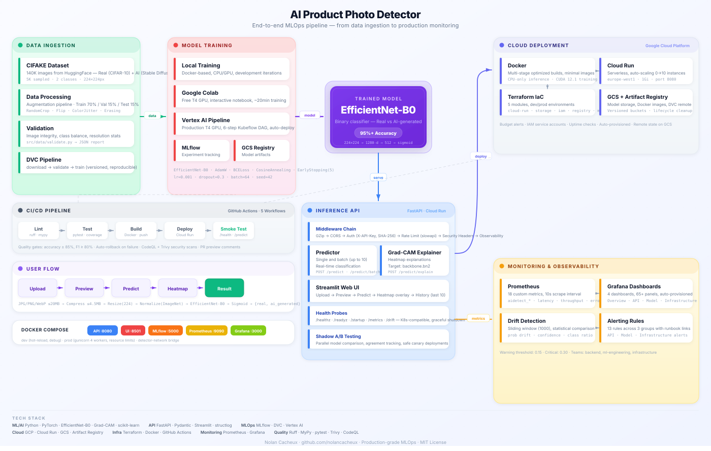

### End-to-End Flow

```
Data Pipeline        Training             Registry           Serving              Monitoring
--------------       ---------------      ---------------    -----------------    ------------------
HuggingFace    --->  Local / Colab /  --> MLflow Tracking -> FastAPI on       --> Prometheus Metrics
CIFAKE Dataset       Vertex AI (T4)       Model Artifacts    Cloud Run            Grafana Dashboards
DVC Versioning       EfficientNet-B0      DVC Remote (GCS)   Auth + Rate Limit    GCP Cloud Monitoring
Validation           CosineAnnealingLR    Checkpoints        Grad-CAM Endpoint    Drift Detection
```

**Components**: DVC manages data versioning with GCS remote. Training on local GPU, Colab, or Vertex AI. MLflow tracks experiments. FastAPI serves predictions. Prometheus/Grafana provide observability. Terraform provisions all infrastructure.

---


# Technology Stack

| Category | Technologies | Purpose |
|----------|-------------|---------|
| **ML / AI** | Python 3.11, PyTorch 2.0+, timm, pytorch_grad_cam | Training, transfer learning, explainability |
| **MLOps** | DVC, MLflow, Vertex AI | Data versioning, experiment tracking, cloud training |
| **Backend** | FastAPI, Pydantic v2, structlog, Prometheus client | API serving, validation, logging, metrics |
| **Infrastructure** | Terraform (5 modules), Docker (multi-stage), GitHub Actions (5 workflows) | IaC, containerization, CI/CD |
| **Cloud (GCP)** | Cloud Run, GCS, Artifact Registry, Cloud Monitoring, Budget Alerts | Serverless hosting, storage, registry, observability |
| **Frontend** | Streamlit | Interactive web UI for image upload and prediction |
| **Quality** | pytest (316 tests), ruff, mypy, bandit, pip-audit | Testing, linting, type checking, security scanning |

**Key Design Choices**: All components open-source except GCP. Stack prioritizes reproducibility (DVC + MLflow), security (bandit + pip-audit + auth), and observability (Prometheus + Grafana + drift detection).

---


# Repository Structure

```
ai-product-photo-detector/
|-- .github/workflows/    # 5 CI/CD pipelines (CI, CD, training, PR preview, quota)
|-- docker/               # 3 Dockerfiles: API (multi-stage), Training (GPU), UI
|-- docs/                 # 8 documentation files + architecture SVG
|-- src/
|   |-- inference/        # FastAPI app, routes, auth, rate limiting, schemas
|   |-- training/         # Model definition, trainer, dataset, augmentations
|   |-- monitoring/       # Prometheus metrics, drift detection
|   |-- data/             # DVC pipeline stages: download, validate
|-- terraform/
|   |-- modules/          # 5 modules: cloud_run, storage, registry, iam, monitoring
|   |-- environments/     # dev/ and prod/ with separate tfvars
|-- tests/                # 316 tests across 27 files
|-- dvc.yaml              # 3-stage pipeline: download -> validate -> train
|-- pyproject.toml        # Dependencies, tool configs (ruff, mypy, pytest)
```

**Key Principle**: Clear separation of concerns. Each directory has a single responsibility. Training code never imports inference code and vice versa.

---


# End-to-End Data Flow

```
[1. HuggingFace] --> [2. DVC Download] --> [3. Validation]
                                                  |
[6. DVC Push] <-- [5. Checkpoint] <-- [4. Training (Local/Colab/Vertex)]
      |
[7. FastAPI on Cloud Run] --> [8. Prometheus 25+ metrics] --> [9. Grafana + GCP]
```

**9-step pipeline**: HuggingFace dataset versioned by DVC, validated for integrity and balance, used to train EfficientNet-B0 (tracked by MLflow), checkpointed and pushed to GCS, served via FastAPI on Cloud Run with auth and Grad-CAM, monitored by Prometheus/Grafana with drift detection.

---


# Environment Comparison: Dev vs Prod

| Aspect | Development | Production |
|--------|-------------|------------|
| **Cloud Run Memory** | 512 Mi | 1 Gi |
| **Cloud Run CPU** | 1 vCPU | 2 vCPU |
| **Scaling** | Scale-to-zero | Configurable min instances |
| **Authentication** | Disabled | JWT tokens required |
| **Rate Limiting** | Relaxed | Strict per-client limits |
| **Budget Alert** | 10 EUR | 50 EUR |
| **Monitoring** | Disabled | Prometheus + Grafana + GCP |
| **Docker Runtime** | uvicorn --reload | Gunicorn with 4 workers |
| **Terraform State** | Local backend | Remote GCS backend (locking) |
| **Logging Level** | DEBUG | INFO |
| **Security Headers** | Relaxed CORS | Strict CORS, CSP, HSTS |

**Why two environments?** Dev optimizes for speed and cost. Prod optimizes for reliability, security, and performance. Terraform manages both through separate tfvars sharing the same modules.

---

<!-- _class: section-header -->

# II. ML Model

## EfficientNet-B0, training pipeline, and Grad-CAM explainability

---

# Model Selection: EfficientNet-B0

### Why EfficientNet-B0?

| Criterion | EfficientNet-B0 | Alternatives Considered |
|-----------|-----------------|------------------------|
| **Parameters** | 5.3M (lightweight) | ResNet-50: 25.6M, VGG-16: 138M |
| **ImageNet Top-1** | 77.1% (strong baseline) | Comparable to much larger models |
| **Inference Speed** | Fast (ideal for API serving) | Larger models add latency |
| **Memory Footprint** | Low (fits Cloud Run limits) | Critical for serverless deployment |

### Transfer Learning Strategy

- **Backbone**: EfficientNet-B0 pretrained on ImageNet (1000 classes), loaded via `timm`
- **Input**: 224 x 224 RGB, normalized with ImageNet mean/std
- **Output**: Binary classification -- Real (0) vs AI-Generated (1)
- **Device Detection**: Automatic CUDA > MPS > CPU priority
- **Freezing**: Optional backbone freezing to reduce training time and overfitting risk

The `timm` library provides a unified API for loading pretrained models, removing the classifier head, and accessing the feature dimension.

---


# Classifier Head Architecture

### Full Model Pipeline (Input to Loss)

```
Input (224x224x3) --> EfficientNet-B0 Backbone (pretrained, optionally frozen)
  --> Global Average Pooling (1280-dim)
  --> Linear(1280,512) + BatchNorm + ReLU + Dropout(0.3)
  --> Linear(512,1) + BCEWithLogitsLoss
  --> Sigmoid --> Prediction (0=Real, 1=AI-Generated)
```

**Classifier Head Layers:**

| Layer | Purpose |
|-------|---------|
| Linear(1280, 512) | Dimensionality reduction |
| BatchNorm1d(512) | Stabilizes training, faster convergence |
| ReLU | Non-linear activation |
| Dropout(0.3) | Regularization (30% drop rate) |
| Linear(512, 1) | Single logit output |
| BCEWithLogitsLoss | Numerically stable binary cross-entropy |

---


# Data Pipeline and Validation

**Dataset**: CIFAKE (HuggingFace Hub) — real photos paired with AI-generated counterparts. Binary classification, downloaded via DVC (stage 1).

**Validation (DVC stage 2):**

| Check | On Failure |
|-------|------------|
| Directory structure (train/test, class subdirs) | Aborts |
| PIL integrity (opens every image) | Logs warning, skips |
| Class balance ratio | Aborts |
| Resolution statistics | Logged to MLflow |

**Augmentation (train only)**: RandomResizedCrop, HorizontalFlip, Rotation(15), ColorJitter. Corrupted images: auto-retry (max 5). Formats: JPEG/PNG/WebP.

---


# Training Pipeline -- Hyperparameters

### Hyperparameters

| Parameter | Value | Rationale |
|-----------|-------|-----------|
| **Learning rate** | 1e-4 | Conservative for fine-tuning pretrained weights |
| **Batch size** | 32 | Balances GPU memory and gradient stability |
| **Max epochs** | 50 | Upper bound; early stopping triggers earlier |
| **Weight decay** | 1e-4 | L2 regularization to reduce overfitting |
| **Gradient clipping** | max_norm = 1.0 | Prevents exploding gradients |
| **Dropout** | 0.3 | Classifier head regularization |

### Optimizer and Scheduler

- **Optimizer**: AdamW -- Adam with decoupled weight decay
- **Scheduler**: CosineAnnealingLR -- smooth LR reduction following cosine curve
- **Early Stopping**: Monitors val loss with configurable patience, restores best weights

### Reproducibility

All seeds fixed: `random`, `numpy`, `torch.manual_seed`, `torch.cuda.manual_seed_all`. `cudnn.deterministic = True`, `cudnn.benchmark = False` for identical results on same hardware.

---


# Training Pipeline -- Tracking and Checkpoints

### MLflow Experiment Tracking

Every run logs: all hyperparameters, architecture, dataset version, augmentation config, per-epoch metrics (train/val loss, accuracy, LR), and artifacts (best checkpoint, curves, confusion matrix, classification report).

### Checkpoint Contents

Single `.pt` file: model state dict, optimizer state dict, scheduler state dict, training config, epoch number, best validation metric. Allows exact resumption of interrupted runs.

### Metrics and Evaluation

| Metric | Description | Quality Gate |
|--------|-------------|--------------|
| Accuracy | Correct predictions / total | >= 0.85 |
| Precision | TP / (TP + FP) per class | -- |
| Recall | TP / (TP + FN) per class | -- |
| F1-Score | Harmonic mean of precision/recall | >= 0.80 |
| AUC-ROC | Area under ROC curve | -- |

**Outputs**: Confusion matrix (PNG), ROC curve with AUC, classification report, baseline comparison, metrics.json. CI fails if accuracy < 0.85 or F1 < 0.80.

---

# Grad-CAM Explainability

**What is Grad-CAM?**
Gradient-weighted Class Activation Mapping produces visual explanations of which image regions most influenced the prediction. It computes gradients of the target class flowing into the final convolutional layer, generating a heatmap overlaid on the original image.

**Implementation Details:**
- **Library**: pytorch_grad_cam -- supports multiple CAM variants
- **Target Layer**: backbone.bn2 (batch norm after last conv block)
- **Output**: Base64-encoded JPEG heatmap overlay
- **Color Map**: JET -- red = high activation, blue = low activation

**API Integration:**
- **Endpoint**: POST /predict/explain -- returns prediction + Grad-CAM heatmap
- **Rate Limiting**: 10 req/min (Grad-CAM is ~2-3x slower than standard prediction)
- **Response**: JSON with class label, confidence score, and base64 heatmap

 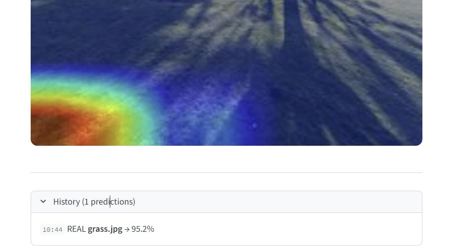

---

<!-- _class: section-header -->

# III. API Serving and Security

## FastAPI endpoints, authentication, and inference pipeline

---

# FastAPI -- API Endpoints

Complete list of all HTTP endpoints exposed by the prediction API service.

| Method | Path | Description |
|--------|------|-------------|
| GET | /health | Health check for liveness monitoring |
| GET | /healthz | Kubernetes-compatible liveness probe |
| GET | /readyz | Readiness probe (model loaded check) |
| GET | /startup | Startup probe (200 after model init) |
| GET | /docs | Swagger OpenAPI interactive documentation |
| POST | /predict | Single image classification (multipart/form-data) |
| POST | /predict/batch | Batch prediction (up to 10 images, 50MB limit) |
| POST | /predict/explain | Prediction + Grad-CAM heatmap (base64 JPEG) |
| GET | /drift | Drift detection status (prediction distribution shift) |
| GET | /metrics | Prometheus-format metrics |
| DELETE | /privacy | GDPR-compliant data deletion |
| GET | /v1/predict | API v1 versioned prediction |
| GET | /v1/health | API v1 versioned health check |

Separate probes for liveness, readiness, and startup. All POST endpoints validate content-type, format, and size. Every response includes a unique request_id.

---

# Authentication and Security

**API Key Authentication:**
- Keys hashed with SHA-256 -- plaintext never persisted
- Auth via `X-API-Key` header; comparison uses `hmac.compare_digest()` (constant-time, prevents timing attacks)

**Rate Limiting:**

| Endpoint | Limit | Reason |
|----------|-------|--------|
| POST /predict | 30 req/min | Standard inference |
| POST /predict/batch | 5 req/min | High resource consumption |
| POST /predict/explain | 10 req/min | Grad-CAM is expensive |

**Security Headers (every response):**
- **HSTS**: Forces HTTPS connections
- **CSP**: Restricts resource loading origins
- **X-Frame-Options**: DENY (prevents clickjacking)
- **X-Content-Type-Options**: nosniff
- **X-XSS-Protection**: 1; mode=block

**Additional**: CORS (no wildcard in prod), input validation (10MB max), graceful shutdown (30s drain), GZip compression

---

# Inference Pipeline

**Predictor Class** -- three-stage architecture:

- **Model Loading**: Weights from GCS, eval mode, automatic device placement
- **Preprocessing**: Resize 224x224, normalize with ImageNet constants (mean/std match training exactly)
- **Inference**: Forward pass, softmax, class mapping

**Auto-Device Detection** (priority order):
1. CUDA (NVIDIA GPU) -- preferred for production
2. MPS (Apple Metal) -- macOS local development
3. CPU -- fallback

**Key Features:**
- PIL images explicitly closed after transform to prevent memory leaks
- **Batch inference**: Up to 10 images stacked into single tensor for one forward pass
- Every request tagged with unique request_id for distributed tracing via structured JSON logs

---

# Shadow Mode and A/B Testing

**Shadow Mode: Safe Model Comparison in Production**

Every request is duplicated: primary model serves the response, shadow model logs metrics only.

- Primary model processes request and returns prediction to user
- Shadow model processes same request in parallel, output logged but never returned
- Both predictions, confidence scores, and latencies recorded for offline comparison

**Metrics Compared:**
- **Accuracy delta**: agreement rate between shadow and primary over time
- **Latency**: P50, P95, P99 for both models
- **Prediction distribution**: class proportion similarity

**Use Case**: Deploy new model as shadow for 24-48h, verify it matches/exceeds current model, then swap.

**Drift Detection:**
- Sliding window of recent predictions monitors distribution shift
- Detects data drift (input changes) and concept drift (input-output relationship changes)
- Alert triggered when prediction class proportions diverge from training distribution

---

# Swagger UI -- Interactive API Documentation

**Auto-Generated OpenAPI Documentation**

FastAPI generates a complete OpenAPI 3.0 spec served as interactive Swagger UI at `/docs`.

**Key Features:**
- **Every endpoint documented** with HTTP method, path, and description
- **Pydantic schemas** auto-converted to JSON Schema with field descriptions and examples
- **Try-it-out**: Send real requests from browser -- upload images, set headers, see live responses
- **Authentication**: Supports X-API-Key header for authenticated testing from docs page

**Access**: Available at `https://<service-url>/docs` in any environment (dev, staging, production)

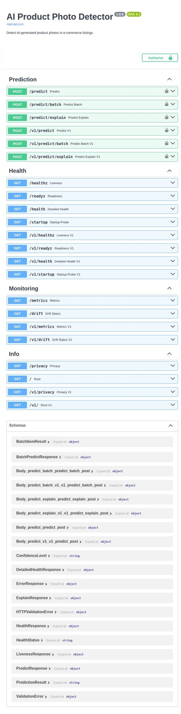

---

<!-- _class: section-header -->

# IV. Infrastructure as Code

## Terraform, Docker, and Google Cloud Platform

---

# Google Cloud Platform Services

**8 GCP services** orchestrated for a complete MLOps production environment.

| Service | Purpose | Key Configuration |
|---------|---------|-------------------|
| **Cloud Run** | Serverless containers | Auto-scaling 0-to-N, pay-per-request, HTTP/2 |
| **Cloud Storage** | Object storage | DVC remote, Terraform state, model weights |
| **Artifact Registry** | Docker images | Auto-cleanup policies for old tags |
| **Cloud Monitoring** | Observability | Uptime checks every 60s, alert policies |
| **Cloud Build** | Image builds | Builds from source, pushes to registry |
| **Vertex AI** | ML training | GPU jobs (T4/A100), integrates with GCS |
| **IAM** | Access management | Least-privilege service accounts |
| **Budget Alerts** | Cost management | Thresholds at 50%, 80%, 100% |

```
Code Push --> Cloud Build --> Artifact Registry --> Cloud Run
Vertex AI (training) --> GCS (artifacts) ---------> Cloud Run
Cloud Monitoring (uptime + alerts) <--------------- Cloud Run
```

All resources provisioned exclusively through Terraform.

---

# Terraform -- Modular Architecture

**5 Reusable Modules**, each responsible for a single GCP resource category:

| Module | Resources | Key Features |
|--------|-----------|--------------|
| **cloud-run** | Service, IAM bindings | Health probes, dynamic env vars, conditional public access |
| **storage** | GCS Bucket, lifecycle rules | Uniform access, temp file cleanup, soft delete, labels |
| **registry** | Artifact Registry repo | Docker format, cleanup policies, configurable location |
| **iam** | Service Account, roles | Least-privilege: only 4 required roles |
| **monitoring** | Uptime checks, alerts | HTTP checks every 60s, 5xx alerts, auto-close 30min |

**Module Dependency Graph:**
```
                    +---> [storage] (GCS buckets)
[iam] (service ---->+---> [registry] (Artifact Registry)
 account)           +---> [cloud-run] (uses SA, pulls from registry)
                    +---> [monitoring] (watches Cloud Run)
```

IAM creates the service account first. Other modules reference it via Terraform resource references -- no explicit `depends_on` needed. Remote state stored in GCS with per-environment key prefix.

---

# Terraform -- GCS Bucket Configuration

**Bucket**: `ai-product-detector-487013-mlops-data`

| Setting | Value |
|---------|-------|
| Location | europe-west1 (Belgium) |
| Storage Class | STANDARD |
| Access Control | Uniform bucket-level (no per-object ACLs) |
| Soft Delete | 7 days retention |

**Lifecycle Rules and Labels:**

| Rule / Label | Details |
|-------------|---------|
| Temp files cleanup | Prefix `tmp/`, `temp/`, `cache/` AND age > 90 days -- auto-delete |
| Archived cleanup | Archived storage class AND age > 30 days -- auto-delete |
| Labels | `app=ai-product-detector`, `environment=dev/prod`, `managed_by=terraform` |

Rules run automatically via GCS -- no cron needed. Labels enable cost allocation and resource filtering.

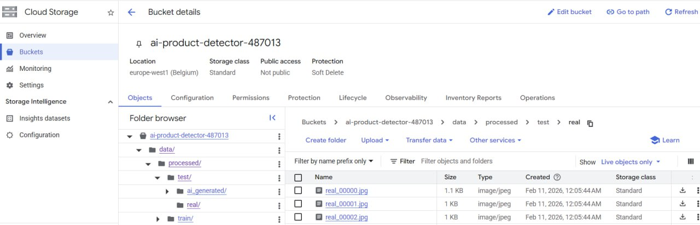 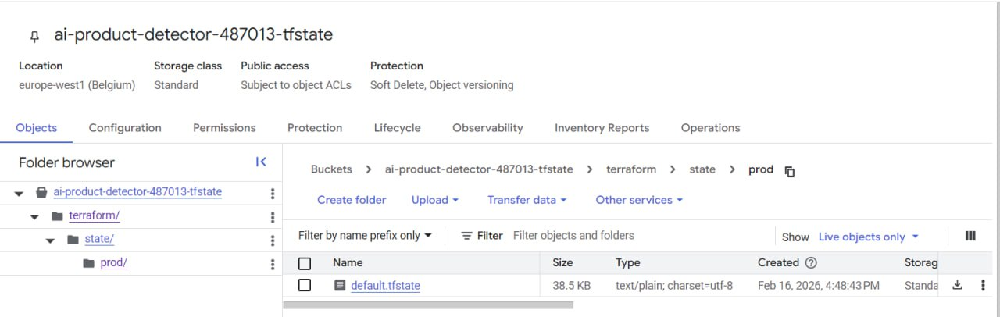

---

# Terraform -- Cloud Run Deployment

**Cloud Run v2 API** (google_cloud_run_v2_service)

| Probe | Protocol | Path/Port | Timeout | Purpose |
|-------|----------|-----------|---------|---------|
| Startup | TCP | Container port | 240s | Model loading time (30-60s from GCS) |
| Liveness | HTTP GET | /healthz | 10s | Detect crashed containers |
| Readiness | HTTP GET | /readyz | 5s | Gate traffic until model ready |

| Setting | Dev | Prod |
|---------|-----|------|
| Min instances | 0 (scale-to-zero) | Configurable (1+) |
| Memory / CPU | 512Mi / 1 | 1Gi / 1-2 |

**Dynamic env vars** via Terraform `for_each` -- adding a new var requires one line change. Includes: MODEL_PATH, API_KEY_HASH, LOG_LEVEL, ENVIRONMENT, GCS_BUCKET. Optional custom domain mapping and IAM public access control.

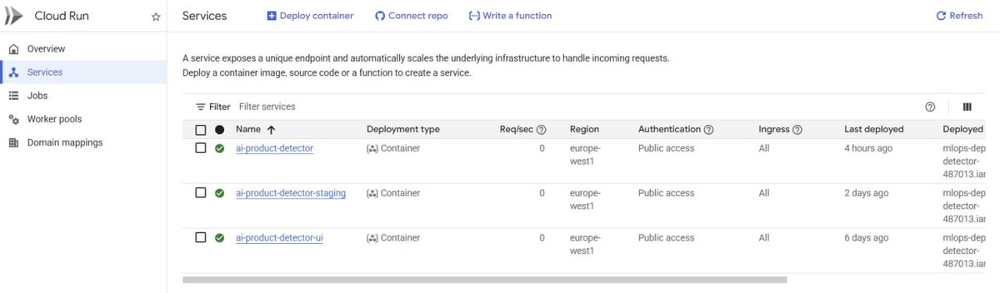

---

# Terraform -- IAM and Monitoring

**Service Account: 4 Least-Privilege Roles**

| Role | Why Needed |
|------|------------|
| roles/artifactregistry.reader | Pull Docker images at startup |
| roles/logging.logWriter | Send logs to GCP |
| roles/monitoring.metricWriter | Export custom metrics |
| roles/storage.objectAdmin | Load model weights, save predictions, read DVC data |

**Alert Policies:**

| Alert | Condition | Action |
|-------|-----------|--------|
| Uptime Failure | /health non-200 for 2+ checks | Email owners |
| 5xx Error Rate | Exceeds threshold over 5min | Email owners |
| Budget 50% / 80% / 100% | Monthly spend thresholds | Email notification |

Uptime checks: HTTP GET every 60s from multiple GCP regions. Auto-close: alerts resolve after 30min if condition clears.

---

# Docker -- Multi-Stage Builds

**3 Dockerfiles**, each optimized for its use case:

| Dockerfile | Base | Key Features |
|-----------|------|-------------|
| **API (Production)** | python:3.11-slim | 2-stage build: builder + runtime. Non-root user (UID 1001). CPU-only PyTorch. HEALTHCHECK every 30s. Zero build tools in final image. |
| **Training (GPU)** | nvidia/cuda:12.1.0-cudnn8-runtime | CUDA 12.1 + cuDNN 8 for Vertex AI (T4/A100). Larger image (ephemeral). |
| **UI (Streamlit)** | python:3.11-slim | Same multi-stage pattern. Port 8501. Non-root. UI deps only. |

**Image Size Optimizations:**
- `apt-get install --no-install-recommends` + `rm -rf /var/lib/apt/lists/*`
- Combined RUN commands to minimize layers
- `.dockerignore` excludes .venv/, .git/, tests/, data/, notebooks/, __pycache__/

---

# Docker Compose -- Full Stack

**3-File Composition**: `docker-compose.yml` (base) + `.dev.yml` + `.prod.yml`

| Service | Port | Role |
|---------|------|------|
| api | 8000 | FastAPI prediction server |
| ui | 8501 | Streamlit web interface |
| prometheus | 9090 | Metrics collection |
| grafana | 3000 | Dashboards |
| mlflow | 5000 | Experiment tracking |

| Setting | Dev | Prod |
|---------|-----|------|
| API server | uvicorn --reload | Gunicorn 4 workers |
| Volumes | Source mounted (hot reload) | Code baked into image |
| Resource limits | None | CPU: 2.0, RAM: 2GB |
| Grafana password | Default admin/admin | Required (`GF_ADMIN_PASSWORD:?must be set`) |
| Build context | Local Dockerfile | Pre-built from Artifact Registry |

Health checks on all services enable auto-restart. Network isolation via Docker bridge.

---

<!-- _class: section-header -->

# V. CI/CD Pipelines and Automation

## GitHub Actions, Dependabot, and automated rollback

---

# GitHub Actions -- 5 Workflows

**1. CI Pipeline (ci.yml)** -- Triggered on every push and pull request
Runs linting, type checking, unit tests, and security scanning to validate code quality before merge.

**2. CD Pipeline (cd.yml)** -- Triggered on push to main branch
Builds Docker image, pushes to Artifact Registry, deploys to Cloud Run, runs smoke tests, and performs automatic rollback on failure.

**3. Model Training (model-training.yml)** -- Manual trigger via workflow_dispatch
Submits GPU training jobs to Vertex AI, evaluates the resulting model against quality gates, and deploys if thresholds are met.

**4. PR Preview (pr-preview.yml)** -- Triggered on pull request events
Automatically comments on PRs with deployment preview information and environment details.

**5. Request Quota (request-quota.yml)** -- Manual trigger
Manages GPU quota requests for Google Cloud to ensure training resources are available.

**Additional Automation:**
- **Dependabot** configured for 3 ecosystems: pip, github-actions, docker
- **Concurrency groups:** cancel-in-progress on PRs, sequential on CD

---

# CI Pipeline -- Quality Gates

**8-step pipeline on every push/PR:**

| Step | Tool | Purpose |
|------|------|---------|
| 1 | pip (cached) | Install dependencies (keyed on pyproject.toml hash) |
| 2 | ruff check + format | Code style, import ordering, formatting |
| 3 | mypy (strict) | Static type analysis on all src/ modules |
| 4 | pytest --cov | Full test suite with coverage measurement |
| 5 | JUnit XML | Machine-readable test results for GitHub |
| 6 | pip-audit | Scan dependencies against CVE databases |
| 7 | bandit | Detect Python security anti-patterns |
| 8 | CodeQL | Advanced SAST via GitHub Advanced Security |

**Artifacts**: `coverage.xml`, `test-results.xml` uploaded to Actions summary. Coverage badge auto-generated. `RATE_LIMIT_ENABLED=false` during tests.

```
Push/PR --> Deps --> Lint --> Types --> Tests --> pip-audit --> Bandit --> CodeQL --> Merge
```

---

# CD Pipeline -- Continuous Deployment

**Trigger:** Push to `main` (after CI passes) | **Environment:** production

| Step | Action |
|------|--------|
| 1 | GCP auth via service account key |
| 2 | Configure Docker CLI for Artifact Registry |
| 3 | Build image with commit SHA tag |
| 4 | Push to `europe-west1-docker.pkg.dev/{project}/{repo}` |
| 5 | `gcloud run deploy` with env vars |
| 6 | Record current revision ID |
| 7 | Run 3 smoke tests against live deployment |
| 8 | On failure: rollback to previous revision |
| 9 | Verify rollback success |

**Smoke Tests (3 mandatory):**
- `GET /health` -- HTTP 200, status "healthy"
- `GET /docs` -- Swagger UI accessible
- `POST /predict` -- Valid classification response

On failure, automatic rollback to last known-good revision.

---

# Model Training Pipeline -- Vertex AI

**Trigger:** `workflow_dispatch` (manual) with configurable inputs

| Input | Default | Description |
|-------|---------|-------------|
| epochs | 10 | Training epochs |
| batch_size | 32 | Batch size |
| memory | 16Gi | Container memory |
| image_tag | latest | Training container tag |

**Pipeline Steps:**

| Step | Action |
|------|--------|
| 1 | Upload training data to GCS |
| 2 | Build GPU Docker image (CUDA 12.1) |
| 3 | Submit Vertex AI CustomJob (n1-standard-4 + T4 GPU) |
| 4 | GPU fallback: retry on CPU if T4 unavailable |
| 5 | Evaluate against quality gates (accuracy >= 0.85, F1 >= 0.80) |
| 6 | Deploy new model to Cloud Run if gates pass |
| 7 | Job summary with metrics and status badges |

---

# Dependabot and Automated Security

**Dependabot -- Automated Dependency Updates**

| Ecosystem | Scope | Schedule |
|-----------|-------|----------|
| pip | Python packages in pyproject.toml | Weekly (Monday) |
| github-actions | Workflow action versions | Weekly (Monday) |
| docker | Base images in Dockerfiles | Weekly (Monday) |

Dependabot scans weekly, creates PRs with updates/changelogs, CI runs all gates on each PR.

**Security Layers in CI:**

| Tool | Detects | Behavior |
|------|---------|----------|
| pip-audit | Known CVEs in Python deps | Fails CI on critical vulnerability |
| bandit | Security anti-patterns (exec, hardcoded passwords, etc.) | Reports in CI summary |
| CodeQL | Complex patterns (injection, XSS, data flow) | Results in Security tab |

Security job uses `continue-on-error: true` -- findings visible but don't block pipeline, allowing triage without blocking development.

---

<!-- _class: section-header -->

# VI. Monitoring and Observability

## Prometheus, Grafana, alerting, and drift detection

---

# Monitoring Stack -- Prometheus + Grafana

```
FastAPI App --(/metrics, 15s)--> Prometheus --(PromQL)--> Grafana
GCP Monitoring --(/health, 60s)--> Cloud Run
```

**Prometheus** scrapes `/metrics` every 15 seconds, collecting all application metrics in time-series format.

**4 Grafana Dashboards:**
1. **API Performance** -- request rates, latency P50/P95/P99, error rates, status codes
2. **Infrastructure** -- CPU, memory, instance count, cold starts
3. **Model Metrics** -- confidence distribution, class balance, inference duration, GradCAM timing
4. **Overview** -- high-level health summary combining key metrics

**GCP Monitoring:** Uptime checks every 60s against `/health` with alert policies for downtime.


---

# Application Metrics (25+ Instrumented)

**All metrics at `/metrics` in Prometheus exposition format**

| Metric | Type | Description |
|--------|------|-------------|
| `http_requests_total` | Counter | Total requests (labels: method, endpoint, status) |
| `http_request_duration_seconds` | Histogram | Latency (buckets: 0.1-5.0s) |
| `http_requests_in_progress` | Gauge | Currently active requests |
| `predictions_total` | Counter | Predictions by class and confidence band |
| `prediction_confidence` | Histogram | Confidence score distribution |
| `prediction_duration_seconds` | Histogram | Model inference time |
| `batch_predictions_total` | Counter | Batch prediction requests |
| `batch_size` | Histogram | Batch size distribution |
| `model_info` | Gauge | Model metadata (version, device, backend) |
| `gradcam_duration_seconds` | Histogram | GradCAM generation time |
| `app_info` | Gauge | App metadata (version, environment) |
| `startup_time_seconds` | Gauge | Process start to ready time |


---

# Alerting Rules

**Prometheus Alert Rules (4 defined):**

| Alert | Condition | Duration | Severity |
|-------|-----------|----------|----------|
| HighErrorRate | 5xx rate > 5% | 5 min | Critical |
| HighLatency | P95 > 2 seconds | 10 min | Warning |
| ServiceDown | Zero requests | 5 min | Critical |
| HighRateLimiting | Rate-limited > 10% | 5 min | Warning |

**GCP Monitoring Alerts (2 policies):**

| Alert | Check | Interval |
|-------|-------|----------|
| Uptime Check Failure | HTTP GET /health must return 200 | Every 60s (2 consecutive failures) |
| Error Rate Alert | 5xx count from Cloud Run metrics | Continuous |

**Budget Alerts:** 3 thresholds at 50%, 80%, 100% with email notifications.
**Auto-close:** All alerts resolve 30 minutes after condition clears.


---

# Drift Detection

**Purpose:** Detect when production data diverges from training distribution, signaling need for retraining.

**Monitored Signals:**

| Signal | Measures | Why It Matters |
|--------|----------|----------------|
| Mean prediction score | Average confidence over time | Shift indicates input data changing |
| Prediction std deviation | Spread of confidence values | Increasing spread = more uncertain inputs |
| Class distribution ratio | Real vs AI-Generated ratio | Imbalance shift = data source change |

**API Endpoint:** `GET /drift` returns JSON with window stats (mean, std, count), drift flag, and baseline comparison.

**Prometheus Integration:** Drift metrics exported as gauges for Grafana dashboards, alert rules on configurable thresholds, and historical analysis.

**Operational Value:** Drift detection serves as early warning to trigger retraining via Vertex AI before quality degrades.

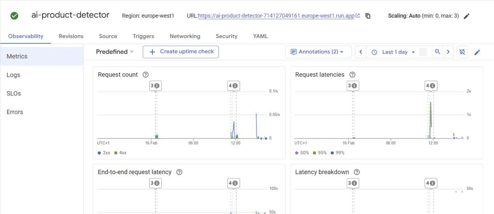

---


<!-- _class: section-header -->

# VII. Testing and Quality Assurance

## 316 tests, CI quality gates, and security scanning

---

# Test Suite Overview -- 316 Tests

**Coverage:** 27 test files covering 30/33 source modules (91% module coverage)

| Category | Count | % | Description |
|----------|-------|---|-------------|
| Unit Tests | ~250 | 80% | Isolated logic testing with mocking |
| Integration Tests | ~33 | 10% | Component interaction (model loading + inference) |
| API Tests | ~21 | 7% | HTTP endpoint testing via FastAPI TestClient |
| Load Tests | scripts | 3% | Locust and K6 for concurrent users |

**Framework and Configuration:**
- **pytest** with automatic discovery, **pytest-asyncio** (auto mode), **pytest-cov** for coverage
- All 316 tests run in CI on every push/PR -- must pass before merge to `main`

```bash
pytest --cov=src --cov-report=term-missing --cov-report=xml -v
```

---

# Test Coverage by Module

**Detailed breakdown of tests per source module:**

| Source Module | Test Count | Test Files |
|--------------|-----------|------------|
| `src/inference/validation.py` | 37 | `test_validation.py`, `test_validation_extended.py` |
| `src/inference/predictor.py` | 30 | `test_predictor.py`, `test_predictor_extended.py` |
| `src/inference/api.py` | 28 | `test_api.py`, `test_integration.py` |
| `src/monitoring/drift.py` | 28 | `test_drift.py`, `test_drift_extended.py` |
| `src/data/validate.py` | 20 | `test_validate.py` |
| `src/pipelines/evaluate.py` | 20 | `test_evaluate.py` |
| `src/ui/app.py` | 18 | `test_app.py` |
| `src/inference/auth.py` | 17 | `test_auth.py` |
| `src/training/train.py` | 13 | `test_train.py` |
| `src/training/model.py` | 7 | `test_model.py` |

**Quality**: Precise assertions, edge cases, mocked externals, error path coverage, thread safety tests.

---

# Test Types and Quality

**Unit Tests (~250):** Isolated testing with `MagicMock`, `AsyncMock`, `patch.dict(os.environ)`

| Edge Case Category | Examples |
|-------------------|---------|
| Empty/missing data | Empty datasets, missing files, None inputs |
| Corrupt/oversized inputs | Truncated files, invalid headers, files > 10MB |
| Malicious inputs | Null bytes, path traversal (`../../etc/passwd`) |
| Concurrency | Thread safety with Barrier + ThreadPoolExecutor |
| Determinism | Identical transforms across repeated runs |

**Integration Tests (~33):** Model loading + inference chain, preprocessing through prediction, end-to-end data flow.

**API Tests (~21):** Full HTTP cycle via TestClient -- health, predict, batch, explain, auth failures, rate limiting (429 + retry-after).

**Load Tests:** Locust scripts for concurrent traffic performance baselines.

---

# CI Quality Gates -- Summary

| Gate | Tool | Fail Criteria |
|------|------|---------------|
| Code Style | ruff check | Any rule violation |
| Formatting | ruff format --check | Any difference |
| Type Safety | mypy --strict | Any type error |
| Tests | pytest --cov (316 tests) | Any failure |
| Dep Audit | pip-audit | Critical CVE |
| Code Security | bandit | Reported in summary |
| SAST | CodeQL | Reported in Security tab |
| CD Smoke Tests | curl + HTTP | Failure triggers rollback |
| Model Quality | Evaluation script | Accuracy < 0.85 or F1 < 0.80 |

**Guarantees:**
- No code reaches `main` without passing lint, types, tests, and security scans
- No deployment stays live without passing 3 smoke tests
- No model deployed without meeting accuracy and F1 thresholds
- Failed deployments auto-rollback to last known-good revision

---

<!-- _class: section-header -->

# VIII. UI, DVC, MLflow, and Vertex AI

## User interface, data versioning, and cloud training

---

# Streamlit Web Interface

Intuitive frontend for end users — communicates with FastAPI backend via REST API.

- **Image Upload** -- drag-and-drop or file browser (JPG, PNG, WEBP)
- **Real-Time Prediction** -- result in under 2 seconds with confidence percentage
- **Grad-CAM Visualization** -- optional heatmap overlay
- **Production-Deployed** -- on Cloud Run, responsive on desktop and mobile

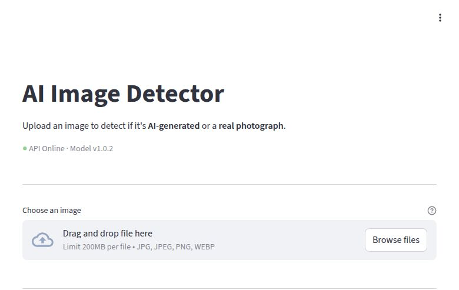

---

# UI Demo -- Upload and Results

**Step-by-step user flow from image upload to prediction result**

The interface guides the user through a simple four-step process:

| Step | Action | Detail |
|------|--------|--------|
| 1 | **Upload an image** | User drags and drops a file or clicks "Browse files" to select a JPG/PNG/WEBP image |
| 2 | **Image sent to API** | The frontend sends the image as a multipart POST request to the `/predict` endpoint on FastAPI |
| 3 | **Result displayed** | The UI shows the classification: "Real" or "AI-Generated" along with the confidence percentage |
| 4 | **View Grad-CAM (optional)** | User can toggle a Grad-CAM heatmap overlay to see which image regions the model focused on |

No login required. No configuration needed. The entire flow completes in under 3 seconds.

<div style="display: flex; gap: 40px; justify-content: center;">

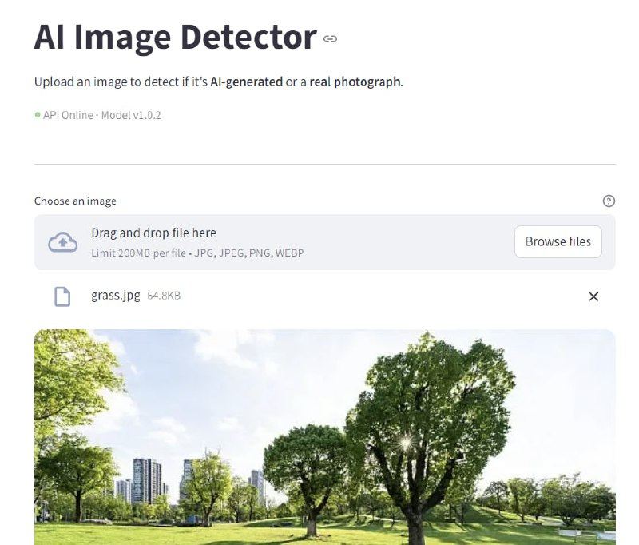 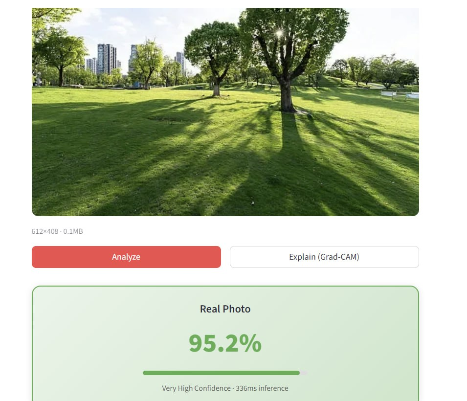

</div>

---

# DVC -- Data Version Control

**Version control for large ML artifacts: datasets, model checkpoints, and pipeline outputs**

DVC extends Git to handle large files via lightweight `.dvc` pointer files committed to Git, while actual data resides in remote storage.

**Pipeline Definition (`dvc.yaml`) -- 3 Stages:**

| Stage | Script | Purpose |
|-------|--------|---------|
| **download** | `scripts/download_dataset.py` | Fetch dataset from HuggingFace Hub |
| **validate** | `scripts/validate_data.py` | Check integrity, class balance, resolutions |
| **train** | `scripts/train.py` | Train with hyperparameters from train_config.yaml |

**Remote Storage:** GCS bucket at `gs://ai-product-detector-487013-mlops-data/dvc`

**Reproducibility:**
- `dvc repro` rebuilds entire pipeline (download, validate, train)
- All dependencies explicitly declared: scripts, configs, data directories
- `.dvc` files track exact versions of `best_model.pt` and dataset

---

# MLflow -- Experiment Tracking

**Track, compare, and manage ML experiments across training runs**

| Category | Tracked Items |
|----------|--------------|
| **Parameters** | learning_rate, batch_size, epochs, architecture, optimizer, scheduler, weight_decay, image_size |
| **Metrics (per epoch)** | train_loss, val_loss, accuracy, precision, recall, F1-score |
| **Artifacts** | best_model.pt, train_config.yaml, evaluation reports, confusion matrix |
| **Model Registry** | Logged via `mlflow.log_model()` for versioning and deployment |

**Infrastructure:**
- Docker Compose service on **port 5000**
- Backend: local filesystem with SQLite database (Docker volume)
- Artifact store: local filesystem (mounted volume)
- Web UI for experiment comparison: overlay loss curves, compare hyperparameters, view artifacts

**Usage:** Developers access `http://localhost:5000` to compare runs, identify best config, and retrieve the winning checkpoint for deployment.

---

# Vertex AI -- Cloud ML Training

**Google Cloud managed ML training with GPU support and pipeline orchestration**

Uses Vertex AI Pipelines (KFP) to run the full training workflow in the cloud.

**Pipeline (6 sequential steps):**

| Step | Component | Description |
|------|-----------|-------------|
| 1 | **validate_data** | Check integrity, 20 spot checks per class, verify readability |
| 2 | **train_model** | GPU training on n1-standard-4 + T4 GPU, EfficientNet-B0 fine-tuning |
| 3 | **evaluate_model** | Compute accuracy, precision, recall, F1, confusion matrix |
| 4 | **compare_baseline** | Compare against production model, proceed only if better |
| 5 | **register_model** | Save to GCS with metadata (metrics, config, timestamp, version) |
| 6 | **deploy_model** | Update Cloud Run service, trigger new revision |

**Controls:**
- **GPU fallback:** Auto-retry on CPU if T4 unavailable
- **Quality gates:** Accuracy >= 0.85 and F1 >= 0.80 required
- **Trigger:** GitHub Actions workflow_dispatch (manual with parameter overrides)

---

<!-- _class: section-header -->

# IX. Audit Results and Conclusion

## Project evaluation, strengths, and next steps

---

# Project Audit -- Score Summary

**Comprehensive automated audit across 6 quality dimensions**

| Domain | Score | Grade |
|--------|-------|-------|
| Code Quality and Architecture | 7.8 / 10 | Good |
| Security | 7.5 / 10 | Good |
| Documentation | 8.8 / 10 | Excellent |
| Testing | 8.5 / 10 | Very Good |
| Infrastructure and DevOps | 8.2 / 10 | Very Good |
| ML Pipeline | 7.5 / 10 | Good |
| **OVERALL** | **8.1 / 10** | **Very Good** |

**Methodology:**
- Automated static analysis across 6 dimensions with multiple sub-criteria
- Evaluates code structure, naming, error handling, coverage, security, documentation, reproducibility, modularity
- Weighted average reflecting relative importance in an MLOps context

---

# Key Strengths

**Production-Ready MLOps Lifecycle** -- Complete coverage from data ingestion to deployment to monitoring.

**Automatic Rollback CD** -- Smoke tests after every deployment; failure auto-restores previous Cloud Run revision.

**Comprehensive Testing** -- 316 tests, 91% module coverage (unit, integration, API, load tests), all in CI.

**Infrastructure as Code** -- 5 Terraform modules with full dev/prod separation and remote GCS state.

**Security-First** -- SHA-256 auth, rate limiting, security headers (CORS, CSP), non-root Docker, strict input validation.

**Model Explainability** -- Grad-CAM heatmaps show which image regions influenced each classification.

**Deep Monitoring** -- 25+ Prometheus metrics, 4 Grafana dashboards, drift detection, GCP budget alerts.

**Documentation** -- 8 detailed docs covering architecture, deployment, API, monitoring. Full Swagger/OpenAPI spec.

---

# Areas for Improvement

**Identified gaps and recommended next steps**

| Area | Current State | Improvement |
|------|--------------|-------------|
| **DVC Pipeline** | Missing `evaluate` stage, no DVC metrics tracking | Add evaluate stage, enable `dvc metrics diff` for experiment comparison |
| **Mixed Precision Training** | Not implemented | Enable `torch.cuda.amp` for ~2x GPU training speedup |
| **Model Registry** | Epoch-based versioning (`1.0.{epoch}`) | Formal registry with stage promotion (staging / production / archived) |
| **Workload Identity** | Static JSON service account keys | Migrate to GCP Workload Identity Federation for keyless auth |

> These improvements are prioritized for the next iteration. The current system is fully functional in production and handles all core MLOps requirements.

---

# Conclusion

**A production-grade MLOps system covering the full machine learning lifecycle**

**Data Versioning (DVC)** --> **Training (Local / Colab / Vertex AI)** --> **Serving (FastAPI + Cloud Run)** --> **Monitoring (Prometheus + Grafana)** --> **Continuous Deployment (GitHub Actions)**

| Principle | Implementation |
|-----------|---------------|
| **Reproducibility** | DVC pipelines, fixed seeds, versioned configs, deterministic Docker |
| **Automation** | CI/CD with 6 quality gates, auto-rollback, Dependabot |
| **Observability** | 25+ Prometheus metrics, 4 Grafana dashboards, drift detection, budget alerts |
| **IaC** | 5 Terraform modules, dev/prod separation, Dockerized services, remote state |
| **Quality** | 316 tests, 91% module coverage, pre-merge CI, post-deploy smoke tests |

Overall audit score: **8.1 / 10 (Very Good)**. End-to-end MLOps maturity suitable for real-world production. Every stage -- data, training, serving, monitoring -- is automated, tested, and documented.

---

# Live Demo

**Try the API right now:**

| | |
|---|---|
| **Swagger UI** | `https://ai-product-detector-714127049161.europe-west1.run.app/docs` |
| **Health Check** | `https://ai-product-detector-714127049161.europe-west1.run.app/health` |

**Quick test with curl:**

```bash
curl -X POST "https://ai-product-detector-714127049161.europe-west1.run.app/predict" \
  -F "file=@your_image.jpg"
```

The API is live on Google Cloud Run (europe-west1). Upload any product photo and get an instant Real / AI-Generated classification with confidence score.

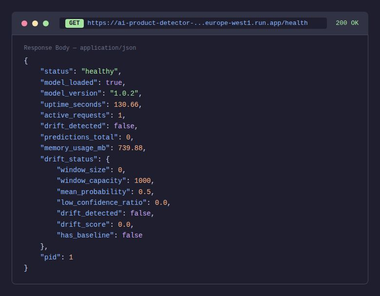

---

# Links and Resources

**Project:**

| Resource | URL |
|----------|-----|
| GitHub Repository | `github.com/nolancacheux/AI-Product-Photo-Detector` |
| Live API (Production) | `https://ai-product-detector-714127049161.europe-west1.run.app` |
| API Documentation | `https://ai-product-detector-714127049161.europe-west1.run.app/docs` |

**Author:**

| | |
|----------|-----|
| **Name** | Nolan Cacheux |
| **LinkedIn** | `linkedin.com/in/nolan-cacheux` |
| **Website** | `nolancacheux.com` |

GitHub repository contains all source code, infrastructure, documentation, CI/CD workflows, and test suites.

---

<!-- _class: title -->

# Thank You

### Questions?

**Nolan Cacheux**

`linkedin.com/in/nolan-cacheux` | `nolancacheux.com`

`github.com/nolancacheux/AI-Product-Photo-Detector`
